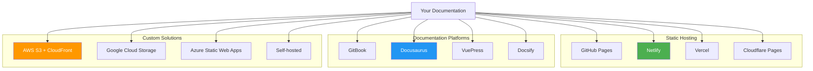
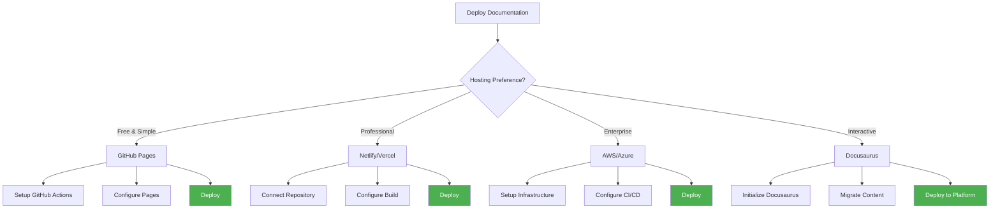
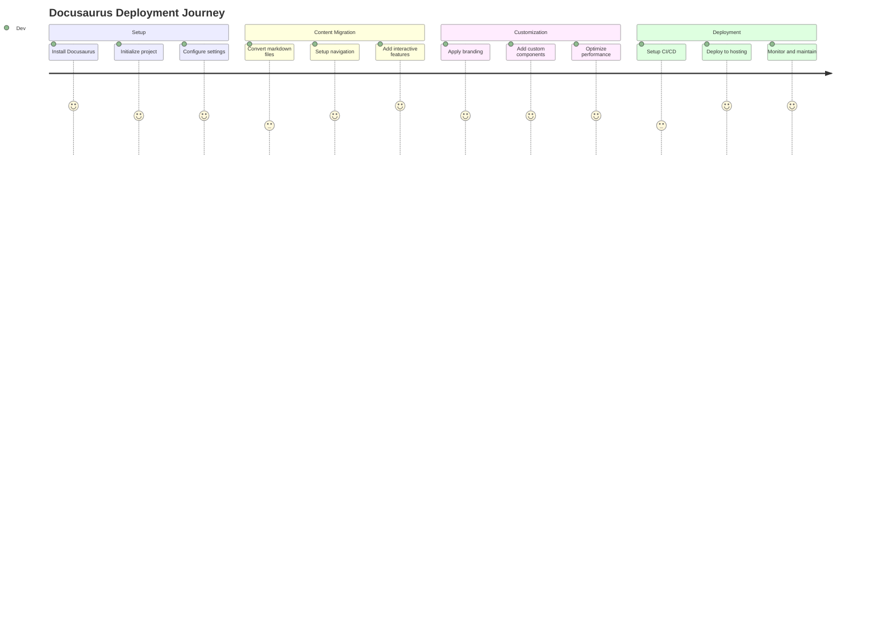
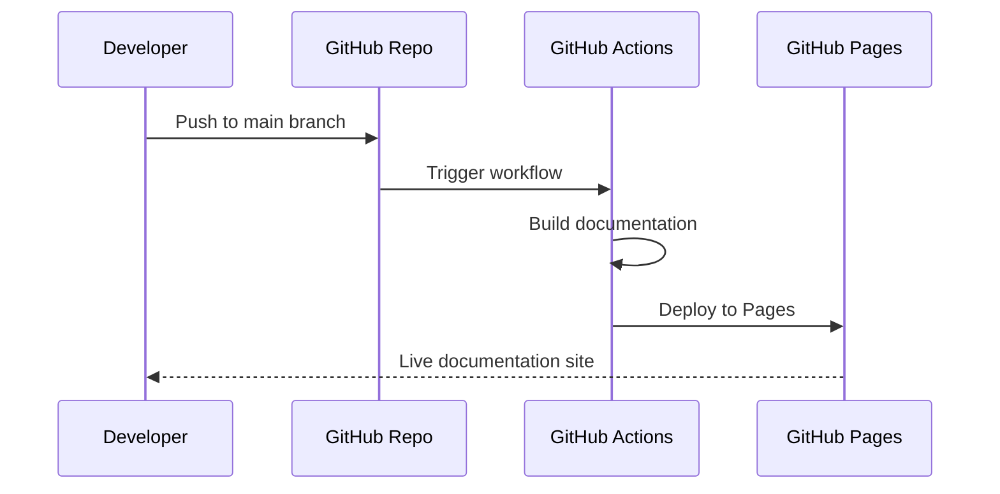

# 🚀 Documentation Deployment Guide

Deploy your Saros SDK documentation site with visual workflows and multiple hosting options.

## Deployment Options Overview



## Quick Deployment Decision Tree



---

## 🎯 Recommended: Docusaurus Deployment

### Why Docusaurus?
- ✅ Built for technical documentation
- ✅ React-based with interactive components
- ✅ Excellent search functionality
- ✅ Version management
- ✅ Mobile responsive
- ✅ Fast and SEO-friendly

### Step-by-Step Docusaurus Setup



#### 1. Initialize Docusaurus

```bash
# Create new Docusaurus site
npx create-docusaurus@latest saros-docs classic --typescript

cd saros-docs

# Install additional dependencies
npm install @docusaurus/plugin-content-docs @docusaurus/theme-mermaid
```

#### 2. Configure docusaurus.config.js

```javascript
import {themes as prismThemes} from 'prism-react-renderer';
import type {Config} from '@docusaurus/types';

const config: Config = {
  title: 'Saros SDK Documentation',
  tagline: 'Build next-generation DeFi applications with DLMM technology',
  favicon: 'img/favicon.ico',
  url: 'https://docs.saros.finance',
  baseUrl: '/',
  
  // GitHub pages deployment config
  organizationName: 'saros-finance',
  projectName: 'saros-sdk-docs',
  
  onBrokenLinks: 'throw',
  onBrokenMarkdownLinks: 'warn',
  
  // Internationalization
  i18n: {
    defaultLocale: 'en',
    locales: ['en'],
  },
  
  // Plugins
  plugins: [
    '@docusaurus/plugin-content-docs',
    '@docusaurus/theme-mermaid'
  ],
  
  // Themes
  themes: ['@docusaurus/theme-mermaid'],
  
  presets: [
    [
      'classic',
      {
        docs: {
          sidebarPath: './sidebars.ts',
          editUrl: 'https://github.com/saros-finance/saros-sdk-docs/tree/main/',
        },
        blog: false,
        theme: {
          customCss: './src/css/custom.css',
        },
      },
    ],
  ],
  
  themeConfig: {
    image: 'img/saros-social-card.jpg',
    navbar: {
      title: 'Saros SDK',
      logo: {
        alt: 'Saros Logo',
        src: 'img/logo.svg',
      },
      items: [
        {
          type: 'docSidebar',
          sidebarId: 'tutorialSidebar',
          position: 'left',
          label: 'Documentation',
        },
        {
          href: 'https://github.com/saros-finance/saros-sdk-docs',
          label: 'GitHub',
          position: 'right',
        },
      ],
    },
    footer: {
      style: 'dark',
      links: [
        {
          title: 'Documentation',
          items: [
            {
              label: 'Getting Started',
              to: '/docs/getting-started/installation',
            },
            {
              label: 'API Reference',
              to: '/docs/api-reference/typescript-sdk',
            },
          ],
        },
        {
          title: 'Community',
          items: [
            {
              label: 'Discord',
              href: 'https://discord.gg/saros',
            },
            {
              label: 'Twitter',
              href: 'https://twitter.com/sarosfinance',
            },
          ],
        },
      ],
    },
    prism: {
      theme: prismThemes.github,
      darkTheme: prismThemes.dracula,
      additionalLanguages: ['rust', 'toml'],
    },
    algolia: {
      appId: 'YOUR_APP_ID',
      apiKey: 'YOUR_API_KEY',
      indexName: 'saros-docs',
    },
  },
  
  markdown: {
    mermaid: true,
  },
};

export default config;
```

#### 3. Migrate Content Structure

```bash
# Create directory structure
mkdir -p docs/getting-started
mkdir -p docs/core-concepts
mkdir -p docs/sdk-guides
mkdir -p docs/api-reference
mkdir -p docs/tutorials
mkdir -p docs/code-examples
mkdir -p static/img

# Copy existing markdown files
cp -r ../getting-started/* docs/getting-started/
cp -r ../core-concepts/* docs/core-concepts/
cp -r ../tutorials/* docs/tutorials/
cp -r ../api-reference/* docs/api-reference/
```

#### 4. Configure Sidebar Navigation

```javascript
// sidebars.ts
import type {SidebarsConfig} from '@docusaurus/plugin-content-docs';

const sidebars: SidebarsConfig = {
  tutorialSidebar: [
    'introduction',
    {
      type: 'category',
      label: '🚀 Getting Started',
      items: [
        'getting-started/prerequisites',
        'getting-started/installation',
        'getting-started/configuration',
        'getting-started/first-transaction',
      ],
    },
    {
      type: 'category',
      label: '📚 Core Concepts',
      items: [
        'core-concepts/amm-vs-dlmm',
        'core-concepts/bin-liquidity',
      ],
    },
    {
      type: 'category',
      label: '📖 SDK Guides',
      items: [
        'sdk-guides/typescript-sdk',
        'sdk-guides/dlmm-sdk',
        'sdk-guides/rust-sdk',
      ],
    },
    {
      type: 'category',
      label: '💻 Code Examples',
      items: [
        'code-examples/basic-swap',
        'code-examples/auto-compound',
        'code-examples/il-calculator',
        'code-examples/range-orders',
        'code-examples/multi-hop-routing',
      ],
    },
    {
      type: 'category',
      label: '📝 API Reference',
      items: [
        'api-reference/typescript-sdk',
        'api-reference/dlmm-sdk',
        'api-reference/rust-sdk',
      ],
    },
  ],
};

export default sidebars;
```

---

## 🌐 Hosting Platform Guides

### GitHub Pages (Free)



#### Setup GitHub Actions

Create `.github/workflows/deploy.yml`:

```yaml
name: Deploy to GitHub Pages

on:
  push:
    branches: [main]
  pull_request:
    branches: [main]

jobs:
  deploy:
    name: Deploy to GitHub Pages
    runs-on: ubuntu-latest
    steps:
      - uses: actions/checkout@v4
      - uses: actions/setup-node@v4
        with:
          node-version: 18
          cache: npm

      - name: Install dependencies
        run: npm ci
      - name: Build website
        run: npm run build

      # Deploy to GitHub Pages
      - name: Deploy to GitHub Pages
        uses: peaceiris/actions-gh-pages@v3
        if: github.ref == 'refs/heads/main'
        with:
          github_token: ${{ secrets.GITHUB_TOKEN }}
          publish_dir: ./build
```

### Netlify (Professional)

```bash
# 1. Connect your GitHub repository to Netlify
# 2. Configure build settings:
Build command: npm run build
Publish directory: build
```

#### Netlify Configuration

Create `netlify.toml`:

```toml
[build]
  publish = "build"
  command = "npm run build"

[[redirects]]
  from = "/*"
  to = "/index.html"
  status = 200

[build.environment]
  NODE_VERSION = "18"
```

### Vercel (Professional)

```bash
# Install Vercel CLI
npm i -g vercel

# Deploy
vercel --prod
```

#### Vercel Configuration

Create `vercel.json`:

```json
{
  "framework": "docusaurus-2",
  "buildCommand": "npm run build",
  "outputDirectory": "build",
  "devCommand": "npm start",
  "cleanUrls": true,
  "trailingSlash": false
}
```

---

## 🔧 Advanced Features

### Search Integration

#### Algolia DocSearch

```javascript
// In docusaurus.config.js
algolia: {
  appId: 'YOUR_APP_ID',
  apiKey: 'YOUR_SEARCH_API_KEY',
  indexName: 'saros-docs',
  contextualSearch: true,
  searchParameters: {},
  searchPagePath: 'search',
},
```

### Analytics

#### Google Analytics

```javascript
// In docusaurus.config.js
gtag: {
  trackingID: 'G-XXXXXXXXXX',
  anonymizeIP: true,
},
```

### Custom Components

Create interactive components:

```tsx
// src/components/SwapDemo.tsx
import React from 'react';

export default function SwapDemo() {
  return (
    <div className="swap-demo">
      <h3>Interactive Swap Demo</h3>
      <div className="demo-container">
        {/* Interactive swap interface */}
      </div>
    </div>
  );
}
```

---

## 📊 Performance Optimization

### Build Optimization

```javascript
// webpack.config.js
module.exports = function (context, options) {
  return {
    mergeStrategy: { "module.rules": "prepend" },
    module: {
      rules: [
        {
          test: /\.md$/,
          use: [
            {
              loader: '@docusaurus/mdx-loader',
              options: {
                remarkPlugins: [
                  [require('remark-mermaid'), { simple: true }]
                ]
              }
            }
          ]
        }
      ]
    }
  };
};
```

### CDN Configuration

```javascript
// For large assets
const config = {
  staticDirectories: ['static'],
  webpack: {
    resolve: {
      alias: {
        '@site/static': path.resolve(__dirname, 'static'),
      },
    },
  },
};
```

---

## 🚀 Launch Checklist

### Pre-Launch

- [ ] All Mermaid diagrams render correctly
- [ ] Interactive components work
- [ ] Mobile responsive design
- [ ] Search functionality works
- [ ] All links are functional
- [ ] SEO metadata configured
- [ ] Analytics tracking setup

### Post-Launch

- [ ] Monitor performance metrics
- [ ] Set up uptime monitoring
- [ ] Configure error tracking
- [ ] Setup automated backups
- [ ] Plan content updates
- [ ] Monitor user feedback

---

## 📈 Monitoring & Maintenance

### Performance Monitoring

```javascript
// Add performance tracking
const config = {
  scripts: [
    {
      src: '/js/analytics.js',
      async: true,
    }
  ],
};
```

### Automated Updates

```yaml
# .github/workflows/update-content.yml
name: Update Documentation
on:
  schedule:
    - cron: '0 0 * * 0' # Weekly
  workflow_dispatch:

jobs:
  update:
    runs-on: ubuntu-latest
    steps:
      - name: Update dependencies
        run: npm update
      - name: Check for broken links
        run: npm run check-links
      - name: Deploy if successful
        run: npm run deploy
```

---

## 🤝 Community Contributions

### Contribution Workflow

```mermaid
gitgraph
    commit id: "Initial docs"
    branch feature
    checkout feature
    commit id: "Add new guide"
    commit id: "Add examples"
    checkout main
    merge feature
    commit id: "Deploy update"
```

### Content Guidelines

- Use clear, concise language
- Include code examples
- Add visual diagrams where helpful
- Maintain consistent formatting
- Test all code examples
- Update navigation as needed

---

*Ready to deploy your documentation? Choose a platform above and follow the step-by-step guide! 🚀*