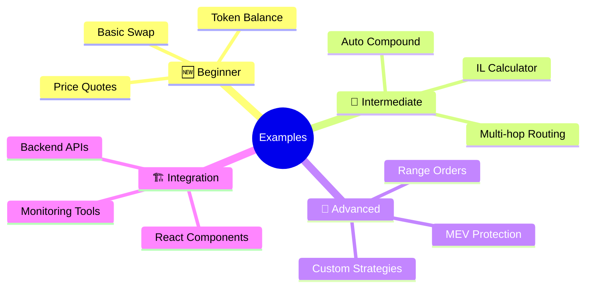
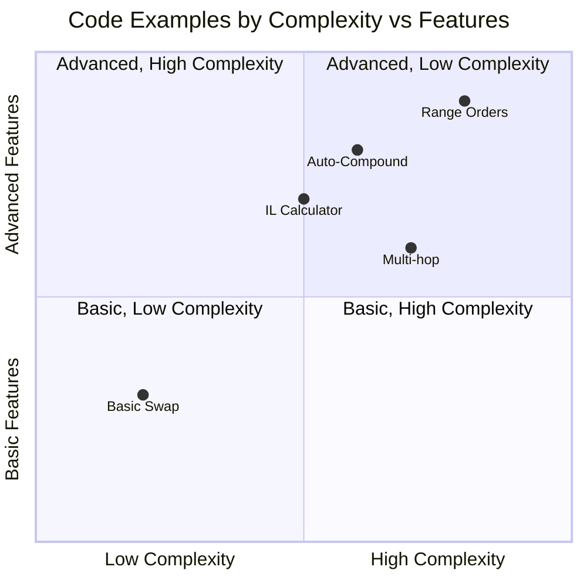
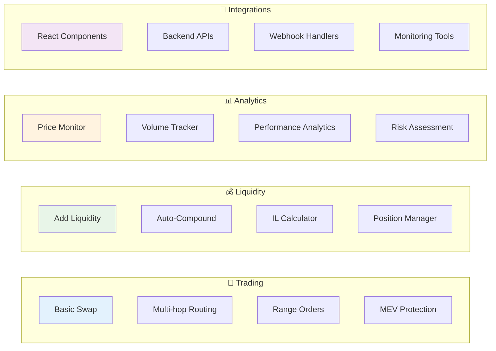
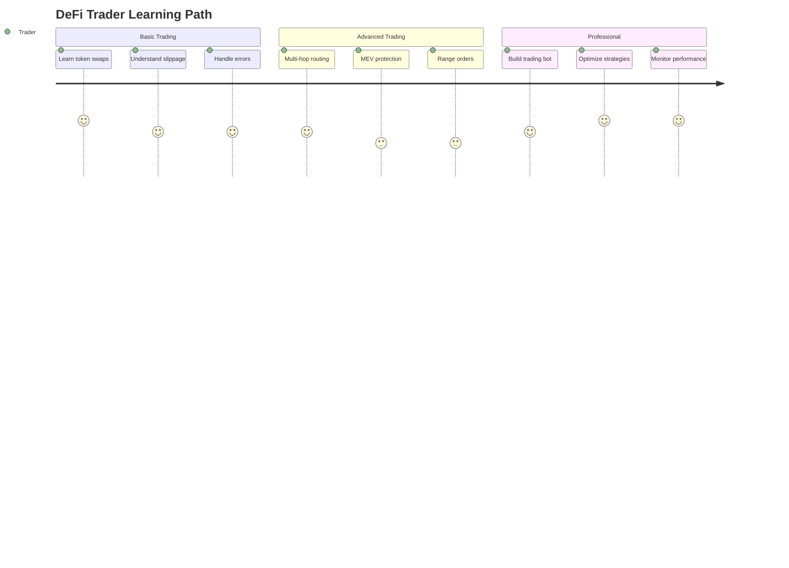
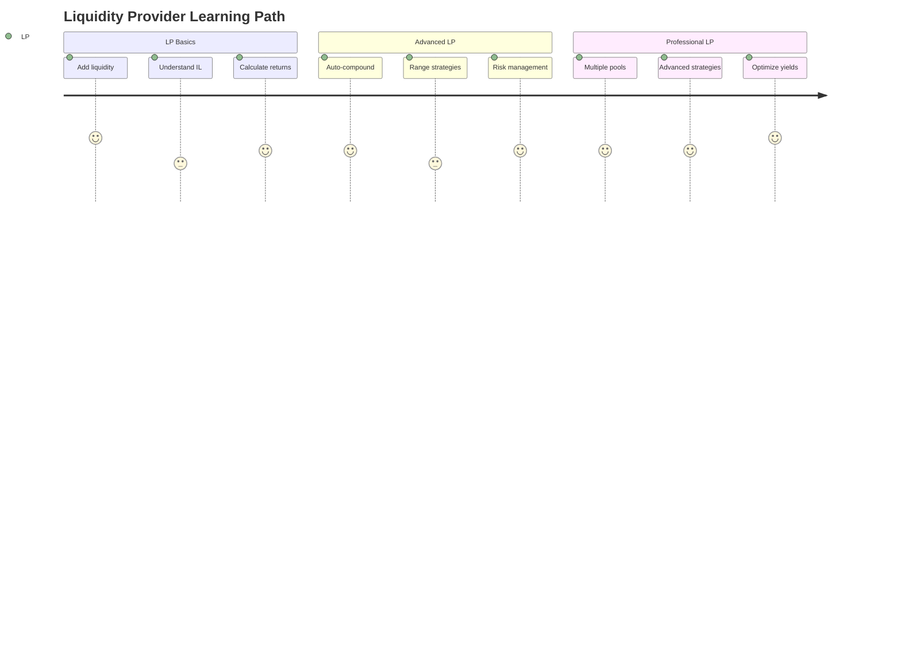
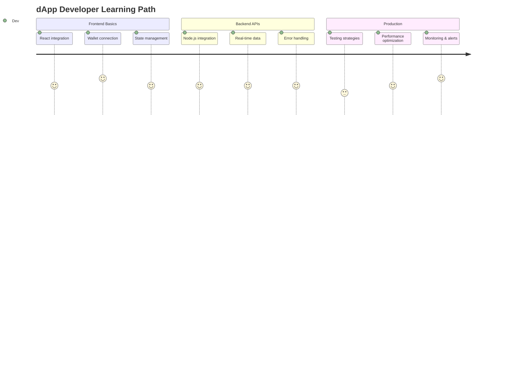

# 🎨 Interactive Example Gallery

> Explore production-ready Saros SDK examples with visual previews and difficulty levels

## Quick Navigation



---

## 📊 Example Difficulty Matrix



---

## 🏆 Featured Examples

Choose your preferred language: **[⚡ TypeScript](#typescript-examples)** | **[🦀 Rust](#rust-examples)**

### 🔥 TypeScript Examples - Production-Ready Applications

<table>
<tr>
<td width="50%">

#### [🔄 01. Swap with Dynamic Slippage](./code-examples/typescript/01-swap-with-slippage/)

**Difficulty**: 🟢 Beginner  
**Time to Complete**: ~15 minutes  
**Features**: ✅ Dynamic slippage ✅ Price monitoring ✅ Error handling

```typescript
// Quick Preview
const swap = new SlippageSwap(connection, wallet);
const result = await swap.executeSwap({
  fromToken: 'SOL',
  toToken: 'USDC',
  amount: 1.5,
  maxSlippage: 0.5
});
```

**What You'll Learn**:
- AMM swap mechanics
- Slippage calculation
- Transaction building
- Error recovery

[📂 View Code](./code-examples/typescript/01-swap-with-slippage/) | [▶️ Run Example](./code-examples/typescript/01-swap-with-slippage/README.md#quick-start)

</td>
<td width="50%">

#### [🔄 02. Auto-Compound Yield Optimizer](./code-examples/typescript/02-auto-compound/)

**Difficulty**: 🟡 Intermediate  
**Time to Complete**: ~30 minutes  
**Features**: ✅ Multi-strategy ✅ Gas optimization ✅ Performance tracking

```typescript
// Quick Preview
const autoCompounder = new AutoCompounder({
  strategy: 'AGGRESSIVE',
  gasThreshold: 0.001,
  compoundInterval: 3600
});
await autoCompounder.start();
```

**What You'll Learn**:
- Yield farming strategies
- Automated execution
- Gas optimization
- Performance monitoring

[📂 View Code](./code-examples/typescript/02-auto-compound/) | [▶️ Run Example](./code-examples/typescript/02-auto-compound/README.md#quick-start)

</td>
</tr>
<tr>
<td width="50%">

#### [📊 03. Impermanent Loss Calculator](./code-examples/typescript/03-impermanent-loss-calc/)

**Difficulty**: 🟡 Intermediate  
**Time to Complete**: ~25 minutes  
**Features**: ✅ Real-time calculation ✅ Historical analysis ✅ Report generation

```typescript
// Quick Preview
const calculator = new ILCalculator();
const analysis = await calculator.analyze({
  poolAddress: POOL_ADDRESS,
  initialPrices: { tokenA: 50, tokenB: 1 },
  currentPrices: { tokenA: 60, tokenB: 1 }
});
```

**What You'll Learn**:
- IL calculation formulas
- Fee compensation analysis
- Data visualization
- Risk assessment

[📂 View Code](./code-examples/typescript/03-impermanent-loss-calc/) | [▶️ Run Example](./code-examples/typescript/03-impermanent-loss-calc/README.md#quick-start)

</td>
<td width="50%">

#### [🎯 04. DLMM Range Orders](./code-examples/typescript/04-dlmm-range-orders/)

**Difficulty**: 🔴 Advanced  
**Time to Complete**: ~45 minutes  
**Features**: ✅ Concentrated liquidity ✅ Range orders ✅ Position management

```typescript
// Quick Preview
const rangeOrder = new DLMMRangeOrder(connection, wallet);
const position = await rangeOrder.createLimitOrder({
  buyToken: 'SOL',
  sellToken: 'USDC',
  targetPrice: 55,
  amount: 100
});
```

**What You'll Learn**:
- DLMM bin mechanics
- Concentrated liquidity
- Limit order strategies
- Position optimization

[📂 View Code](./code-examples/typescript/04-dlmm-range-orders/) | [▶️ Run Example](./code-examples/typescript/04-dlmm-range-orders/README.md#quick-start)

</td>
</tr>
</table>

### 🦀 Rust Examples - High-Performance Applications

<table>
<tr>
<td width="50%">

#### [⚡ 01. Basic Swap](./code-examples/rust/01-basic-swap/)

**Difficulty**: 🟢 Beginner  
**Time to Complete**: ~20 minutes  
**Features**: ✅ MEV protection ✅ Batch operations ✅ Price analysis ✅ CLI interface

```rust
// Quick Preview
let swap_manager = SwapManager::new(connection, wallet).await?;
let result = swap_manager.execute_swap(SwapParams {
    token_in: "SOL".to_string(),
    token_out: "USDC".to_string(),
    amount: 1.5,
    max_slippage: 0.005,
}).await?;
```

**What You'll Learn**:
- Rust async programming
- High-performance swaps
- MEV protection strategies
- Connection pooling

[📂 View Code](./code-examples/rust/01-basic-swap/) | [▶️ Run Example](./code-examples/rust/01-basic-swap/README.md#quick-start)

</td>
<td width="50%">

#### [🔄 02. Auto-Compound](./code-examples/rust/02-auto-compound/)

**Difficulty**: 🟡 Intermediate  
**Time to Complete**: ~35 minutes  
**Features**: ✅ Multi-threaded ✅ Multiple strategies ✅ Gas optimization ✅ Real-time monitoring

```rust
// Quick Preview
let auto_compounder = AutoCompounder::new(AutoCompoundConfig {
    strategy: CompoundStrategy::Aggressive,
    gas_threshold: 0.001,
    compound_interval: Duration::from_secs(3600),
}).await?;
auto_compounder.start().await?;
```

**What You'll Learn**:
- Async task scheduling
- Performance optimization
- Multi-strategy management
- Error handling patterns

[📂 View Code](./code-examples/rust/02-auto-compound/) | [▶️ Run Example](./code-examples/rust/02-auto-compound/README.md#quick-start)

</td>
</tr>
<tr>
<td width="50%">

#### [📊 03. Impermanent Loss Calculator](./code-examples/rust/03-impermanent-loss-calc/)

**Difficulty**: 🟡 Intermediate  
**Time to Complete**: ~30 minutes  
**Features**: ✅ High precision math ✅ Multiple report formats ✅ Historical analysis ✅ Real-time monitoring

```rust
// Quick Preview
let calculator = ILCalculator::new(config).await?;
let analysis = calculator.calculate_impermanent_loss(CalculationParams {
    pool_address: pool_address.clone(),
    initial_prices: (Decimal::from_str("50")?, Decimal::from_str("1")?),
    current_prices: (Decimal::from_str("60")?, Decimal::from_str("1")?),
}).await?;
```

**What You'll Learn**:
- Precision decimal calculations
- Data analysis techniques
- Report generation
- Real-time data processing

[📂 View Code](./code-examples/rust/03-impermanent-loss-calc/) | [▶️ Run Example](./code-examples/rust/03-impermanent-loss-calc/README.md#quick-start)

</td>
<td width="50%">

#### [🎯 04. DLMM Range Orders](./code-examples/rust/04-dlmm-range-orders/)

**Difficulty**: 🔴 Advanced  
**Time to Complete**: ~50 minutes  
**Features**: ✅ Advanced DLMM ✅ DCA strategies ✅ Grid trading ✅ Take profit/stop loss

```rust
// Quick Preview
let range_manager = RangeOrderManager::new(connection, wallet).await?;
let order = range_manager.create_limit_order(LimitOrderParams {
    buy_token: "SOL".to_string(),
    sell_token: "USDC".to_string(),
    target_price: Decimal::from_str("55")?,
    amount: Decimal::from_str("100")?,
    order_type: OrderType::TakeProfit,
}).await?;
```

**What You'll Learn**:
- Advanced DLMM concepts
- Complex order management
- Risk management strategies
- Performance optimization

[📂 View Code](./code-examples/rust/04-dlmm-range-orders/) | [▶️ Run Example](./code-examples/rust/04-dlmm-range-orders/README.md#quick-start)

</td>
</tr>
</table>

---

## 🗂️ Complete Example Library

### By Category



### By Difficulty Level

| Level | Examples | Skills Required | Time Investment |
|-------|----------|----------------|-----------------|
| 🟢 **Beginner** | Basic Swap, Token Balance, Price Quotes | Basic TypeScript, Solana basics | 15-30 min each |
| 🟡 **Intermediate** | Auto-Compound, IL Calculator, Multi-hop | Advanced TypeScript, DeFi concepts | 30-60 min each |
| 🔴 **Advanced** | Range Orders, MEV Protection, Custom Strategies | Expert TypeScript, Advanced DeFi | 1-2 hours each |
| 🟪 **Expert** | Protocol Integration, Market Making Bots | Full-stack expertise, Production experience | 2+ hours each |

---

## 🚀 Interactive Learning Paths

### Path 1: DeFi Trader


### Path 2: Liquidity Provider


### Path 3: dApp Developer


---

## 🎯 Quick Start Recommendations

### "I want to build a trading interface"
→ Start with [Basic Swap](./code-examples/typescript/01-swap-with-slippage/) → [Multi-hop Routing](./code-examples/typescript/05-multi-hop-routing/)

### "I want to provide liquidity efficiently"
→ Start with [IL Calculator](./code-examples/typescript/03-impermanent-loss-calc/) → [Range Orders](./code-examples/typescript/04-dlmm-range-orders/)

### "I want to automate yield farming"
→ Start with [Auto-Compound](./code-examples/typescript/02-auto-compound/) → Build custom strategies

### "I want to integrate Saros in my dApp"
→ Check [React Integration Guide](./tutorials/react-integration.md) → [API Reference](./api-reference/typescript-sdk.md)

---

## 🔧 Development Tools

### Testing Infrastructure
All examples include:
- ✅ **Jest Test Suites** (52+ tests total)
- ✅ **Error Handling** with recovery strategies
- ✅ **Performance Monitoring** with detailed logs
- ✅ **Type Safety** with full TypeScript support

### Code Quality
- 🔍 **ESLint Configuration** for consistent code style
- 📝 **Comprehensive Documentation** with inline comments
- 🚨 **Error Boundaries** for graceful failure handling
- 📊 **Logging & Analytics** for debugging and monitoring

---

## 🤝 Contributing

Want to add your own example? Check our [Contributing Guide](./CONTRIBUTING.md) for:
- Example structure requirements
- Documentation standards
- Testing requirements
- Review process

### Example Template
```bash
# Clone the template
git clone https://github.com/saros-finance/example-template
cd example-template

# Follow the structure:
src/
├── index.ts          # Main implementation
├── types.ts          # Type definitions
├── utils/            # Helper functions
├── __tests__/        # Test files
└── README.md         # Documentation
```

---

## 📞 Need Help?

- 💬 **Discord**: [Join our community](https://discord.gg/saros)
- 📖 **Documentation**: [Full docs](https://docs.saros.finance)
- 🐛 **Issues**: [GitHub Issues](https://github.com/saros-finance/sdk/issues)
- 📧 **Email**: dev@saros.finance

---

*Ready to build the future of DeFi on Solana? Pick an example and start coding! 🚀*