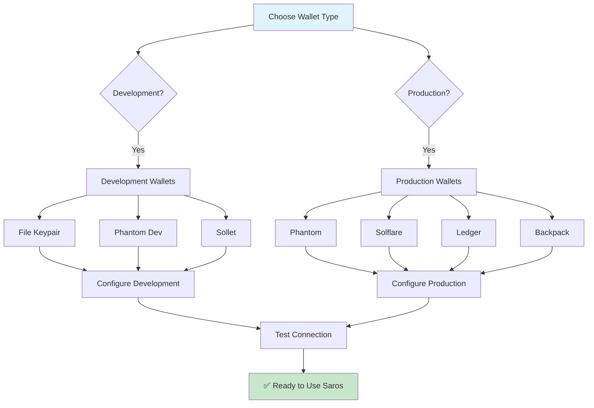

# 🔐 Wallet Setup Guide for Saros SDK

> Complete guide to setting up and configuring Solana wallets for use with Saros Finance SDKs

## Overview

This guide walks you through setting up popular Solana wallets for both development and production use with Saros Finance. Whether you're developing locally, testing on devnet, or building for mainnet, this guide covers all scenarios.

## Wallet Setup Matrix



## 🛠️ Development Environment Setup

### 1. File-Based Keypair (Recommended for Development)

The simplest method for local development and testing.

#### Generate New Keypair

```bash
# Install Solana CLI if not already installed
sh -c "$(curl -sSfL https://release.solana.com/stable/install)"

# Generate new keypair
solana-keygen new --outfile ~/.config/solana/dev-wallet.json

# Set as default
solana config set --keypair ~/.config/solana/dev-wallet.json

# Check public key
solana address
# Output: 7xKXtg2CW87d97TXJSDpbD5jBkheTqA83TZRuJosgAsU

# Check balance
solana balance
```

#### Convert to Base58 Private Key (for SDK)

```bash
# Get base58 private key for use in code
solana-keygen pubkey ~/.config/solana/dev-wallet.json --outfile /dev/stdout | head -c 44 | solana-keygen decode
```

Or use this Node.js script:

```typescript
// scripts/get-private-key.ts
import { Keypair } from '@solana/web3.js';
import fs from 'fs';

const keypairFile = process.env.HOME + '/.config/solana/dev-wallet.json';
const secretKeyString = fs.readFileSync(keypairFile, 'utf8');
const secretKey = Uint8Array.from(JSON.parse(secretKeyString));
const keypair = Keypair.fromSecretKey(secretKey);

console.log('Public Key:', keypair.publicKey.toString());
console.log('Private Key (base58):', Buffer.from(keypair.secretKey).toString('base64'));
```

#### Airdrop Devnet SOL

```bash
# Switch to devnet
solana config set --url https://api.devnet.solana.com

# Request airdrop (max 2 SOL per request)
solana airdrop 2

# Check balance
solana balance
```

### 2. Environment Configuration

Create `.env` file in your project:

```bash
# Development Environment Variables
SOLANA_NETWORK=devnet
SOLANA_RPC_URL=https://api.devnet.solana.com
WALLET_PRIVATE_KEY=your_base58_private_key_here
WALLET_PUBLIC_KEY=7xKXtg2CW87d97TXJSDpbD5jBkheTqA83TZRuJosgAsU

# Optional: Custom RPC (faster)
# SOLANA_RPC_URL=https://solana-devnet.g.alchemy.com/v2/your-api-key
```

### 3. SDK Integration (Development)

#### TypeScript/JavaScript

```typescript
import { Connection, Keypair, PublicKey } from '@solana/web3.js';
import bs58 from 'bs58';
import dotenv from 'dotenv';

dotenv.config();

// Initialize connection
const connection = new Connection(
  process.env.SOLANA_RPC_URL || 'https://api.devnet.solana.com',
  'confirmed'
);

// Load wallet from private key
const wallet = Keypair.fromSecretKey(
  bs58.decode(process.env.WALLET_PRIVATE_KEY!)
);

console.log('Wallet loaded:', wallet.publicKey.toString());

// Verify connection and balance
async function checkWalletSetup() {
  try {
    const balance = await connection.getBalance(wallet.publicKey);
    console.log('SOL Balance:', balance / 1e9);
    
    if (balance === 0) {
      console.log('⚠️ Wallet has no SOL. Request airdrop:');
      console.log(`solana airdrop 2 ${wallet.publicKey.toString()}`);
    } else {
      console.log('✅ Wallet ready for transactions');
    }
  } catch (error) {
    console.error('❌ Connection failed:', error);
  }
}

checkWalletSetup();
```

#### Rust

```rust
// src/wallet.rs
use solana_client::rpc_client::RpcClient;
use solana_sdk::{
    commitment_config::CommitmentConfig,
    signature::{read_keypair_file, Keypair, Signer},
    native_token::LAMPORTS_PER_SOL,
};
use std::env;

pub struct WalletConfig {
    pub client: RpcClient,
    pub keypair: Keypair,
}

impl WalletConfig {
    pub fn new() -> Result<Self, Box<dyn std::error::Error>> {
        // Load RPC URL from environment
        let rpc_url = env::var("SOLANA_RPC_URL")
            .unwrap_or_else(|_| "https://api.devnet.solana.com".to_string());
            
        let client = RpcClient::new_with_commitment(
            rpc_url,
            CommitmentConfig::confirmed(),
        );

        // Load keypair from file
        let keypair_path = env::var("WALLET_KEYPAIR_PATH")
            .unwrap_or_else(|_| {
                format!("{}/.config/solana/dev-wallet.json", env::var("HOME").unwrap())
            });
            
        let keypair = read_keypair_file(&keypair_path)
            .map_err(|_| "Failed to read keypair file")?;

        Ok(WalletConfig { client, keypair })
    }

    pub async fn check_balance(&self) -> Result<u64, Box<dyn std::error::Error>> {
        let balance = self.client.get_balance(&self.keypair.pubkey())?;
        println!("Wallet: {}", self.keypair.pubkey());
        println!("Balance: {} SOL", balance as f64 / LAMPORTS_PER_SOL as f64);
        
        if balance == 0 {
            println!("⚠️ Wallet has no SOL. Request airdrop:");
            println!("solana airdrop 2 {}", self.keypair.pubkey());
        }
        
        Ok(balance)
    }
}

// Usage example
#[tokio::main]
async fn main() -> Result<(), Box<dyn std::error::Error>> {
    let wallet = WalletConfig::new()?;
    wallet.check_balance().await?;
    println!("✅ Wallet setup complete");
    Ok(())
}
```

## 🌐 Browser Wallet Integration (Production)

### 1. Phantom Wallet Setup

#### Install Phantom

1. Visit [phantom.app](https://phantom.app)
2. Click "Add to Chrome/Firefox/Safari"
3. Create new wallet or import existing
4. Switch to Devnet for testing:
   - Settings → Developer Settings → Change Network → Devnet

#### Integration with Saros dApp

```typescript
// utils/phantom-wallet.ts
import { Connection, PublicKey, Transaction } from '@solana/web3.js';

interface PhantomWallet {
  isPhantom: boolean;
  publicKey: PublicKey | null;
  isConnected: boolean;
  signTransaction(transaction: Transaction): Promise<Transaction>;
  signAllTransactions(transactions: Transaction[]): Promise<Transaction[]>;
  connect(): Promise<{ publicKey: PublicKey }>;
  disconnect(): Promise<void>;
}

declare global {
  interface Window {
    solana?: PhantomWallet;
  }
}

class PhantomWalletAdapter {
  private wallet: PhantomWallet | null = null;

  constructor() {
    if (typeof window !== 'undefined' && window.solana?.isPhantom) {
      this.wallet = window.solana;
    }
  }

  async connect(): Promise<PublicKey> {
    if (!this.wallet) {
      window.open('https://phantom.app/', '_blank');
      throw new Error('Phantom wallet not found. Please install Phantom.');
    }

    try {
      const response = await this.wallet.connect();
      console.log('Connected to Phantom:', response.publicKey.toString());
      return response.publicKey;
    } catch (error) {
      throw new Error('Failed to connect to Phantom: ' + error);
    }
  }

  async disconnect(): Promise<void> {
    if (this.wallet) {
      await this.wallet.disconnect();
    }
  }

  get publicKey(): PublicKey | null {
    return this.wallet?.publicKey || null;
  }

  get isConnected(): boolean {
    return this.wallet?.isConnected || false;
  }

  async signTransaction(transaction: Transaction): Promise<Transaction> {
    if (!this.wallet) throw new Error('Wallet not connected');
    return await this.wallet.signTransaction(transaction);
  }
}

// Usage in React component
import React, { useState, useEffect } from 'react';

export const WalletConnection: React.FC = () => {
  const [wallet] = useState(new PhantomWalletAdapter());
  const [connected, setConnected] = useState(false);
  const [publicKey, setPublicKey] = useState<PublicKey | null>(null);

  const connectWallet = async () => {
    try {
      const pubkey = await wallet.connect();
      setPublicKey(pubkey);
      setConnected(true);
    } catch (error) {
      console.error('Connection failed:', error);
      alert(error.message);
    }
  };

  return (
    <div className="wallet-connection">
      {!connected ? (
        <button onClick={connectWallet} className="connect-btn">
          Connect Phantom Wallet
        </button>
      ) : (
        <div className="wallet-info">
          <p>Connected: {publicKey?.toString().substring(0, 8)}...</p>
          <button onClick={() => wallet.disconnect()}>Disconnect</button>
        </div>
      )}
    </div>
  );
};
```

### 2. Solflare Wallet Setup

#### Install Solflare

1. Visit [solflare.com](https://solflare.com)
2. Download desktop app or browser extension
3. Create wallet or import seed phrase
4. Switch network to Devnet for testing

#### Integration Code

```typescript
// utils/solflare-wallet.ts
import { WalletAdapterNetwork } from '@solana/wallet-adapter-base';
import { SolflareWalletAdapter } from '@solana/wallet-adapter-solflare';

const solflareWallet = new SolflareWalletAdapter({
  network: WalletAdapterNetwork.Devnet, // or Mainnet
});

export async function connectSolflare() {
  try {
    await solflareWallet.connect();
    console.log('Connected to Solflare:', solflareWallet.publicKey?.toString());
    return solflareWallet.publicKey;
  } catch (error) {
    console.error('Solflare connection failed:', error);
    throw error;
  }
}
```

### 3. Universal Wallet Adapter (Recommended)

Use Solana's wallet adapter for maximum compatibility:

```bash
npm install @solana/wallet-adapter-base @solana/wallet-adapter-react @solana/wallet-adapter-react-ui @solana/wallet-adapter-wallets
```

```typescript
// components/WalletProvider.tsx
import React, { FC, ReactNode, useMemo } from 'react';
import { ConnectionProvider, WalletProvider } from '@solana/wallet-adapter-react';
import { WalletModalProvider } from '@solana/wallet-adapter-react-ui';
import {
  PhantomWalletAdapter,
  SolflareWalletAdapter,
  BackpackWalletAdapter,
} from '@solana/wallet-adapter-wallets';
import { WalletAdapterNetwork } from '@solana/wallet-adapter-base';

require('@solana/wallet-adapter-react-ui/styles.css');

interface Props {
  children: ReactNode;
}

export const SarosWalletProvider: FC<Props> = ({ children }) => {
  const network = WalletAdapterNetwork.Devnet; // Change to Mainnet for production
  
  const endpoint = useMemo(() => {
    switch (network) {
      case WalletAdapterNetwork.Devnet:
        return 'https://api.devnet.solana.com';
      case WalletAdapterNetwork.Mainnet:
        return 'https://api.mainnet-beta.solana.com';
      default:
        return 'https://api.devnet.solana.com';
    }
  }, [network]);

  const wallets = useMemo(
    () => [
      new PhantomWalletAdapter(),
      new SolflareWalletAdapter(),
      new BackpackWalletAdapter(),
    ],
    [network]
  );

  return (
    <ConnectionProvider endpoint={endpoint}>
      <WalletProvider wallets={wallets} autoConnect>
        <WalletModalProvider>
          {children}
        </WalletModalProvider>
      </WalletProvider>
    </ConnectionProvider>
  );
};

// Usage in your app
import { WalletMultiButton } from '@solana/wallet-adapter-react-ui';
import { useConnection, useWallet } from '@solana/wallet-adapter-react';

export const SarosApp: FC = () => {
  const { connection } = useConnection();
  const { publicKey, sendTransaction } = useWallet();

  return (
    <div className="app">
      <header>
        <WalletMultiButton />
      </header>
      
      {publicKey && (
        <main>
          <p>Wallet connected: {publicKey.toString()}</p>
          {/* Your Saros SDK integration here */}
        </main>
      )}
    </div>
  );
};
```

## 🔐 Security Best Practices

### 1. Development Security

```typescript
// ✅ GOOD: Use environment variables
const privateKey = process.env.WALLET_PRIVATE_KEY;

// ❌ BAD: Never hardcode private keys
const privateKey = "5KqX7bqP..."; // NEVER DO THIS
```

### 2. Environment Separation

```bash
# .env.development
SOLANA_NETWORK=devnet
SOLANA_RPC_URL=https://api.devnet.solana.com

# .env.production  
SOLANA_NETWORK=mainnet-beta
SOLANA_RPC_URL=https://api.mainnet-beta.solana.com

# .env.local (never commit)
WALLET_PRIVATE_KEY=your_private_key_here
```

### 3. Private Key Management

#### For Development
```typescript
// Good: Load from file system
const keypair = Keypair.fromSecretKey(
  JSON.parse(fs.readFileSync(process.env.KEYPAIR_PATH!, 'utf8'))
);

// Good: Load from environment (base58)
const keypair = Keypair.fromSecretKey(
  bs58.decode(process.env.WALLET_PRIVATE_KEY!)
);

// Bad: Hardcoded in source
const keypair = Keypair.fromSecretKey(new Uint8Array([1,2,3...])); // DON'T
```

#### For Production
- Use hardware wallets (Ledger)
- Use wallet adapters for browser apps
- Never store private keys in frontend code
- Use server-side signing for backend applications

### 4. Network Configuration

```typescript
// Network-aware configuration
const getNetworkConfig = () => {
  const network = process.env.SOLANA_NETWORK || 'devnet';
  
  switch (network) {
    case 'mainnet-beta':
      return {
        rpcUrl: process.env.MAINNET_RPC_URL || 'https://api.mainnet-beta.solana.com',
        commitment: 'confirmed' as Commitment,
        wsUrl: 'wss://api.mainnet-beta.solana.com',
      };
    case 'devnet':
      return {
        rpcUrl: process.env.DEVNET_RPC_URL || 'https://api.devnet.solana.com',
        commitment: 'confirmed' as Commitment,
        wsUrl: 'wss://api.devnet.solana.com',
      };
    default:
      throw new Error(`Unknown network: ${network}`);
  }
};
```

## 🧪 Testing Your Wallet Setup

### 1. Connection Test

```typescript
// test-wallet-connection.ts
async function testWalletConnection() {
  console.log('🧪 Testing wallet connection...\n');
  
  try {
    // Test 1: Connection
    const connection = new Connection(process.env.SOLANA_RPC_URL!, 'confirmed');
    console.log('✅ RPC connection established');
    
    // Test 2: Wallet loading
    const wallet = Keypair.fromSecretKey(bs58.decode(process.env.WALLET_PRIVATE_KEY!));
    console.log('✅ Wallet loaded:', wallet.publicKey.toString());
    
    // Test 3: Balance check
    const balance = await connection.getBalance(wallet.publicKey);
    console.log('✅ Balance retrieved:', balance / LAMPORTS_PER_SOL, 'SOL');
    
    // Test 4: Network info
    const version = await connection.getVersion();
    console.log('✅ Network version:', version['solana-core']);
    
    // Test 5: Recent blockhash (for transaction capability)
    const { blockhash } = await connection.getLatestBlockhash();
    console.log('✅ Recent blockhash retrieved:', blockhash.substring(0, 8) + '...');
    
    console.log('\n🎉 All wallet tests passed!');
    
    return {
      connection,
      wallet,
      balance,
      ready: true,
    };
    
  } catch (error) {
    console.error('❌ Wallet test failed:', error);
    throw error;
  }
}

// Run test
testWalletConnection()
  .then((result) => {
    console.log('Wallet setup complete:', result.ready);
  })
  .catch((error) => {
    console.error('Setup failed:', error.message);
    process.exit(1);
  });
```

### 2. Saros SDK Integration Test

```typescript
// test-saros-integration.ts
import { genConnectionSolana } from '@saros-finance/sdk';

async function testSarosIntegration() {
  console.log('🔄 Testing Saros SDK integration...\n');
  
  try {
    // Test Saros connection helper
    const connection = genConnectionSolana();
    console.log('✅ Saros connection helper works');
    
    // Test with your wallet
    const wallet = Keypair.fromSecretKey(bs58.decode(process.env.WALLET_PRIVATE_KEY!));
    
    // Simulate getting pool info (example)
    const version = await connection.getVersion();
    console.log('✅ Connection via Saros SDK works');
    
    console.log('🎉 Saros SDK integration ready!');
    return true;
    
  } catch (error) {
    console.error('❌ Saros integration failed:', error);
    return false;
  }
}
```

## 📱 Mobile Wallet Configuration

### 1. Phantom Mobile

1. Download Phantom app from App Store/Google Play
2. Create or import wallet
3. Enable developer mode:
   - Settings → Developer Settings
   - Enable "Developer Mode"
   - Change Network to "Devnet"
4. Use WalletConnect for dApp integration

### 2. Solflare Mobile

1. Download Solflare app
2. Create wallet or import seed
3. Switch to Devnet in settings
4. Use mobile browser for dApp access

## 🔄 Wallet Migration & Backup

### 1. Backup Private Keys

```bash
# Backup development keypair
cp ~/.config/solana/dev-wallet.json ~/backups/dev-wallet-backup.json

# Or export private key
solana-keygen pubkey ~/.config/solana/dev-wallet.json --outfile private-key.txt
```

### 2. Seed Phrase Backup (Browser Wallets)

- Write down 12/24 word seed phrase
- Store in secure location (not digital)
- Test recovery process

### 3. Multiple Environment Setup

```bash
# Create different keypairs for different environments
solana-keygen new --outfile ~/.config/solana/dev-wallet.json
solana-keygen new --outfile ~/.config/solana/staging-wallet.json
solana-keygen new --outfile ~/.config/solana/prod-wallet.json

# Switch between them
solana config set --keypair ~/.config/solana/dev-wallet.json
```

## ⚠️ Common Issues & Solutions

### 1. "Wallet not connected" Error

```typescript
// Add connection check
if (!wallet.connected || !wallet.publicKey) {
  throw new Error('Please connect your wallet first');
}
```

### 2. Insufficient SOL for Fees

```bash
# Check balance
solana balance

# Request airdrop (devnet only)
solana airdrop 1

# Or buy SOL on mainnet
```

### 3. RPC Rate Limiting

```typescript
// Use custom RPC endpoints
const CUSTOM_RPC_URLS = {
  devnet: [
    'https://api.devnet.solana.com',
    'https://solana-devnet.g.alchemy.com/v2/your-key',
    'https://devnet.genesysgo.net/',
  ],
  mainnet: [
    'https://api.mainnet-beta.solana.com',
    'https://solana-mainnet.g.alchemy.com/v2/your-key',
    'https://rpc.ankr.com/solana',
  ],
};
```

### 4. Transaction Simulation Failed

```typescript
// Add better error handling
try {
  const signature = await sendTransaction(transaction, connection);
  await connection.confirmTransaction(signature);
} catch (error) {
  console.error('Transaction failed:', error);
  
  // Check if it's a simulation error
  if (error.message.includes('simulation')) {
    console.log('Try increasing compute units or checking balance');
  }
  
  throw error;
}
```

## ✅ Wallet Setup Checklist

### Development Setup
- [ ] Solana CLI installed
- [ ] Keypair generated and saved
- [ ] Private key exported to environment
- [ ] Devnet SOL airdropped
- [ ] Connection test passed
- [ ] Saros SDK integration working

### Browser Wallet Setup
- [ ] Phantom/Solflare installed
- [ ] Wallet created/imported
- [ ] Network switched to Devnet
- [ ] Wallet adapter integrated
- [ ] Connection flow working
- [ ] Transaction signing tested

### Security Checklist
- [ ] Private keys not in source code
- [ ] Environment variables configured
- [ ] Separate dev/prod environments
- [ ] Backup strategy implemented
- [ ] Recovery process tested

## 🚀 Next Steps

Once your wallet is set up:

1. **Test Basic Operations**: [First Transaction Guide](getting-started/first-transaction.md)
2. **Explore SDK Features**: [API Reference](api-reference/typescript-sdk.md)
3. **Build Your First Swap**: [Basic Swap Tutorial](tutorials/01-basic-swap.md)
4. **Advanced Features**: [DLMM Integration](guides/dlmm-deep-dive.md)

## 🆘 Support

If you encounter issues:

- 💬 **Discord**: [Saros Dev Community](https://discord.gg/saros)
- 📖 **Documentation**: [docs.saros.finance](https://docs.saros.finance)
- 🐛 **Issues**: [GitHub Issues](https://github.com/saros-finance/sdk/issues)
- 📧 **Direct Support**: dev@saros.finance

---

**🔐 Security Reminder**: Never share private keys or seed phrases. Always verify wallet addresses before sending funds.