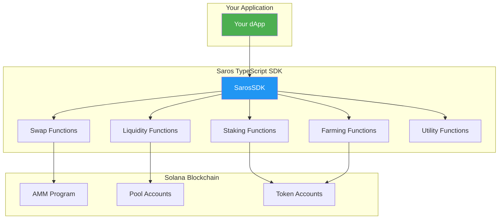
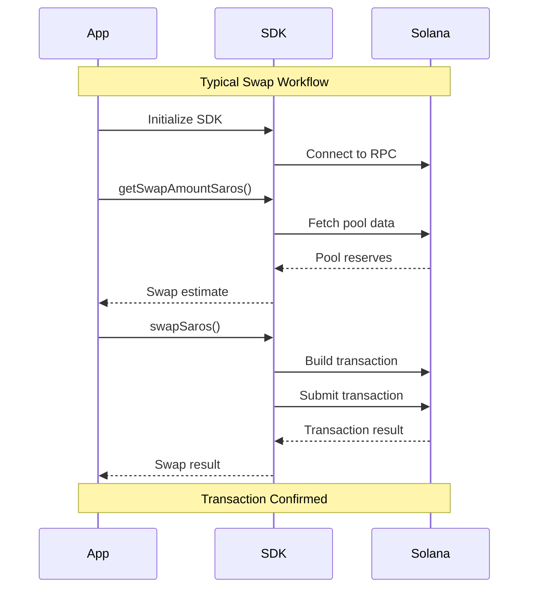

# TypeScript SDK API Reference

## @saros-finance/sdk v2.4.0

Comprehensive API documentation for the Saros Finance TypeScript SDK.

### SDK Architecture Overview



### Common Workflow Patterns



---

## Table of Contents

- [Installation](#installation)
- [Core Classes](#core-classes)
- [Swap Functions](#swap-functions)
- [Liquidity Functions](#liquidity-functions)
- [Staking Functions](#staking-functions)
- [Farming Functions](#farming-functions)
- [Pool Functions](#pool-functions)
- [Utility Functions](#utility-functions)
- [Types and Interfaces](#types-and-interfaces)
- [Constants](#constants)
- [Error Handling](#error-handling)

---

## Installation

```bash
npm install @saros-finance/sdk @solana/web3.js
```

## Core Classes

### SarosSDK

Main SDK class for interacting with Saros Finance.

```typescript
class SarosSDK {
  constructor(config: SDKConfig)
  
  // Properties
  connection: Connection
  wallet: Wallet
  network: 'mainnet-beta' | 'devnet'
  
  // Methods
  async initialize(): Promise<void>
  async getVersion(): string
}
```

#### SDKConfig

```typescript
interface SDKConfig {
  rpcUrl: string
  wallet?: Wallet
  network?: 'mainnet-beta' | 'devnet'
  commitment?: Commitment
}
```

---

## Swap Functions

### swapSaros

Execute a token swap on Saros AMM.

```typescript
async function swapSaros(
  connection: Connection,
  fromTokenAccount: PublicKey,
  toTokenAccount: PublicKey,
  amountIn: BN,
  minAmountOut: BN,
  referrer: PublicKey | null,
  poolAddress: PublicKey,
  swapProgram: PublicKey,
  payer: PublicKey,
  fromMint: PublicKey,
  toMint: PublicKey
): Promise<SwapResult>
```

#### Parameters

| Parameter | Type | Description |
|-----------|------|-------------|
| connection | Connection | Solana connection object |
| fromTokenAccount | PublicKey | Source token account |
| toTokenAccount | PublicKey | Destination token account |
| amountIn | BN | Amount to swap (in smallest units) |
| minAmountOut | BN | Minimum acceptable output |
| referrer | PublicKey \| null | Referrer address for fees |
| poolAddress | PublicKey | AMM pool address |
| swapProgram | PublicKey | Swap program ID |
| payer | PublicKey | Transaction fee payer |
| fromMint | PublicKey | Source token mint |
| toMint | PublicKey | Destination token mint |

#### Returns

```typescript
interface SwapResult {
  hash: string              // Transaction signature
  amountIn: BN             // Actual input amount
  amountOut: BN            // Actual output amount
  priceImpact: number      // Price impact percentage
  fee: BN                  // Trading fee paid
  slot: number             // Transaction slot
}
```

### getSwapAmountSaros

Calculate expected output for a swap.

```typescript
async function getSwapAmountSaros(
  connection: Connection,
  fromMint: string,
  toMint: string,
  amount: number,
  slippage: number,
  poolParams?: PoolParams
): Promise<SwapEstimate>
```

#### Returns

```typescript
interface SwapEstimate {
  amountOut: number
  amountOutWithSlippage: number
  priceImpact: number
  fee: number
  route: string[]
  executionPrice: number
}
```

### swapWithRoute

Execute swap using optimal route.

```typescript
async function swapWithRoute(
  connection: Connection,
  wallet: Wallet,
  route: Route,
  amount: BN,
  slippage: number
): Promise<SwapResult>
```

---

## Liquidity Functions

### addLiquiditySaros

Add liquidity to an AMM pool.

```typescript
async function addLiquiditySaros(
  connection: Connection,
  wallet: Wallet,
  poolAddress: PublicKey,
  tokenAAmount: BN,
  tokenBAmount: BN,
  slippage: number
): Promise<LiquidityResult>
```

#### Returns

```typescript
interface LiquidityResult {
  hash: string
  lpTokensMinted: BN
  tokenADeposited: BN
  tokenBDeposited: BN
  shareOfPool: number
}
```

### removeLiquiditySaros

Remove liquidity from an AMM pool.

```typescript
async function removeLiquiditySaros(
  connection: Connection,
  wallet: Wallet,
  poolAddress: PublicKey,
  lpTokenAmount: BN,
  minTokenA: BN,
  minTokenB: BN
): Promise<RemoveLiquidityResult>
```

#### Returns

```typescript
interface RemoveLiquidityResult {
  hash: string
  tokenAReceived: BN
  tokenBReceived: BN
  lpTokensBurned: BN
}
```

### addLiquidityBalanced

Add liquidity with automatic balancing.

```typescript
async function addLiquidityBalanced(
  connection: Connection,
  wallet: Wallet,
  poolAddress: PublicKey,
  totalValue: number,
  slippage: number
): Promise<LiquidityResult>
```

---

## Staking Functions

### stakeSaros

Stake tokens in Saros staking pool.

```typescript
async function stakeSaros(
  connection: Connection,
  wallet: Wallet,
  stakingPool: PublicKey,
  amount: BN,
  lockPeriod?: number
): Promise<StakeResult>
```

#### Returns

```typescript
interface StakeResult {
  hash: string
  stakedAmount: BN
  stakingAccount: PublicKey
  estimatedAPR: number
  unlockDate?: Date
}
```

### unstakeSaros

Unstake tokens from staking pool.

```typescript
async function unstakeSaros(
  connection: Connection,
  wallet: Wallet,
  stakingAccount: PublicKey,
  amount?: BN  // If not provided, unstakes all
): Promise<UnstakeResult>
```

### claimRewardsSaros

Claim staking rewards.

```typescript
async function claimRewardsSaros(
  connection: Connection,
  wallet: Wallet,
  stakingAccount: PublicKey
): Promise<ClaimResult>
```

#### Returns

```typescript
interface ClaimResult {
  hash: string
  rewardsClaimed: BN
  rewardToken: PublicKey
  nextClaimTime?: Date
}
```

---

## Farming Functions

### depositFarm

Deposit LP tokens into yield farm.

```typescript
async function depositFarm(
  connection: Connection,
  wallet: Wallet,
  farmAddress: PublicKey,
  lpTokenAmount: BN
): Promise<FarmResult>
```

### harvestFarm

Harvest farm rewards.

```typescript
async function harvestFarm(
  connection: Connection,
  wallet: Wallet,
  farmAddress: PublicKey
): Promise<HarvestResult>
```

#### Returns

```typescript
interface HarvestResult {
  hash: string
  rewardsHarvested: {
    token: PublicKey
    amount: BN
  }[]
  nextHarvestTime?: Date
}
```

### withdrawFarm

Withdraw from farm.

```typescript
async function withdrawFarm(
  connection: Connection,
  wallet: Wallet,
  farmAddress: PublicKey,
  amount: BN
): Promise<WithdrawResult>
```

---

## Pool Functions

### getPoolInfo

Get detailed pool information.

```typescript
async function getPoolInfo(
  connection: Connection,
  poolAddress: PublicKey
): Promise<PoolInfo>
```

#### Returns

```typescript
interface PoolInfo {
  address: PublicKey
  tokenA: TokenInfo
  tokenB: TokenInfo
  reserveA: BN
  reserveB: BN
  lpSupply: BN
  feeRate: number
  volume24h: number
  tvl: number
  apy: number
  poolType: 'AMM' | 'STABLE' | 'CONCENTRATED'
}
```

### getAllPools

Get all available pools.

```typescript
async function getAllPools(
  connection: Connection,
  filters?: PoolFilters
): Promise<PoolInfo[]>
```

#### PoolFilters

```typescript
interface PoolFilters {
  tokenMint?: PublicKey
  poolType?: 'AMM' | 'STABLE' | 'CONCENTRATED'
  minTVL?: number
  minVolume?: number
  verified?: boolean
}
```

### createPool

Create a new liquidity pool.

```typescript
async function createPool(
  connection: Connection,
  wallet: Wallet,
  params: CreatePoolParams
): Promise<CreatePoolResult>
```

#### CreatePoolParams

```typescript
interface CreatePoolParams {
  tokenA: PublicKey
  tokenB: PublicKey
  initialPriceRatio: number
  feeRate: number
  poolType?: 'AMM' | 'STABLE'
}
```

---

## Utility Functions

### genConnectionSolana

Generate optimized Solana connection.

```typescript
function genConnectionSolana(
  rpcUrl: string,
  commitment?: Commitment
): Connection
```

### getUserPosition

Get user's position in a pool.

```typescript
async function getUserPosition(
  connection: Connection,
  wallet: PublicKey,
  poolAddress: PublicKey
): Promise<UserPosition>
```

#### Returns

```typescript
interface UserPosition {
  lpTokens: BN
  shareOfPool: number
  tokenAAmount: BN
  tokenBAmount: BN
  pendingRewards: BN
  valueUSD: number
}
```

### calculatePriceImpact

Calculate price impact for a trade.

```typescript
function calculatePriceImpact(
  amountIn: BN,
  reserveIn: BN,
  reserveOut: BN,
  feeRate: number
): number
```

### calculateSlippage

Calculate required slippage for volatile conditions.

```typescript
function calculateSlippage(
  volatility: number,
  tradeSize: number,
  poolLiquidity: number
): number
```

### findBestRoute

Find optimal swap route.

```typescript
async function findBestRoute(
  connection: Connection,
  fromMint: PublicKey,
  toMint: PublicKey,
  amount: BN,
  maxHops?: number
): Promise<Route>
```

#### Returns

```typescript
interface Route {
  path: PublicKey[]
  pools: PublicKey[]
  expectedOutput: BN
  priceImpact: number
  fees: BN
}
```

---

## Types and Interfaces

### TokenInfo

```typescript
interface TokenInfo {
  mint: PublicKey
  symbol: string
  name: string
  decimals: number
  logoURI?: string
  price?: number
}
```

### TransactionOptions

```typescript
interface TransactionOptions {
  skipPreflight?: boolean
  preflightCommitment?: Commitment
  maxRetries?: number
  confirmTimeout?: number
  priorityFee?: number
}
```

### SwapParams

```typescript
interface SwapParams {
  fromToken: PublicKey
  toToken: PublicKey
  amount: BN
  slippage: number
  referrer?: PublicKey
  options?: TransactionOptions
}
```

### PoolStats

```typescript
interface PoolStats {
  volume24h: number
  volume7d: number
  fees24h: number
  fees7d: number
  tvlHistory: TVLDataPoint[]
  volumeHistory: VolumeDataPoint[]
  aprHistory: APRDataPoint[]
}
```

---

## Constants

### Program IDs

```typescript
const SWAP_PROGRAM_ID = new PublicKey('SSwapUtytfBdBn1b9NUGG6foMVPtcWgpRU32HToDUZr')
const STAKING_PROGRAM_ID = new PublicKey('STAKEvGqQTtz6a5p2qCcvv5jZhqN7vZGBFdqpbMGRNk')
const FARM_PROGRAM_ID = new PublicKey('FARMkPt5xpfm9DW3NSXy3JYvKqNphRfpBTV3PkzTqDT')
```

### Fee Rates

```typescript
const FEE_RATES = {
  STABLE_SWAP: 0.04,    // 0.04% for stable pairs
  STANDARD: 0.3,        // 0.3% standard
  VOLATILE: 1.0,        // 1% for volatile pairs
}
```

### Slippage Defaults

```typescript
const DEFAULT_SLIPPAGE = {
  STABLE: 0.1,          // 0.1% for stable pairs
  STANDARD: 0.5,        // 0.5% standard
  VOLATILE: 1.0,        // 1% for volatile
  HIGH_VOLATILITY: 3.0  // 3% for high volatility
}
```

---

## Error Handling

### SarosSDKError

Base error class for SDK errors.

```typescript
class SarosSDKError extends Error {
  code: string
  details?: any
  
  constructor(message: string, code: string, details?: any)
}
```

### Error Codes

```typescript
enum ErrorCode {
  INSUFFICIENT_BALANCE = 'INSUFFICIENT_BALANCE',
  SLIPPAGE_EXCEEDED = 'SLIPPAGE_EXCEEDED',
  POOL_NOT_FOUND = 'POOL_NOT_FOUND',
  INVALID_AMOUNT = 'INVALID_AMOUNT',
  TRANSACTION_FAILED = 'TRANSACTION_FAILED',
  NETWORK_ERROR = 'NETWORK_ERROR',
  INVALID_WALLET = 'INVALID_WALLET',
  PROGRAM_ERROR = 'PROGRAM_ERROR'
}
```

### Error Handling Example

```typescript
try {
  const result = await swapSaros(/* params */);
} catch (error) {
  if (error instanceof SarosSDKError) {
    switch (error.code) {
      case ErrorCode.SLIPPAGE_EXCEEDED:
        // Handle slippage error
        break;
      case ErrorCode.INSUFFICIENT_BALANCE:
        // Handle balance error
        break;
      default:
        // Handle other errors
    }
  }
}
```

---

## Migration Guide

### From v1.x to v2.x

Key changes:
- Renamed `swap()` to `swapSaros()`
- Added `BN` type for all amounts
- New `TransactionOptions` parameter
- Improved error handling

```typescript
// v1.x
const result = await swap(connection, wallet, params);

// v2.x
const result = await swapSaros(
  connection,
  fromTokenAccount,
  toTokenAccount,
  new BN(amount),
  new BN(minAmountOut),
  null,
  poolAddress,
  SWAP_PROGRAM_ID,
  wallet.publicKey,
  fromMint,
  toMint
);
```

---

## Best Practices

1. **Always use BN for amounts** to avoid precision loss
2. **Set appropriate slippage** based on market conditions
3. **Implement retry logic** for network failures
4. **Cache pool information** to reduce RPC calls
5. **Use WebSocket subscriptions** for real-time updates
6. **Batch transactions** when possible
7. **Monitor gas prices** and adjust priority fees

---

## Support

- [GitHub Issues](https://github.com/saros-finance/sdk/issues)
- [Discord](https://discord.gg/saros)
- [Documentation](https://docs.saros.finance)