# Saros Architecture Diagrams

Visual representations of Saros Finance protocol architecture and transaction flows.

## Table of Contents

- [System Architecture](#system-architecture)
- [AMM Swap Flow](#amm-swap-flow)
- [DLMM Architecture](#dlmm-architecture)
- [DLMM Liquidity Provision](#dlmm-liquidity-provision)
- [Auto-Compound Flow](#auto-compound-flow)
- [Multi-Hop Routing](#multi-hop-routing)
- [Yield Farming Architecture](#yield-farming-architecture)
- [SDK Integration Flow](#sdk-integration-flow)

---

## System Architecture

Overall Saros Finance protocol architecture showing all components.

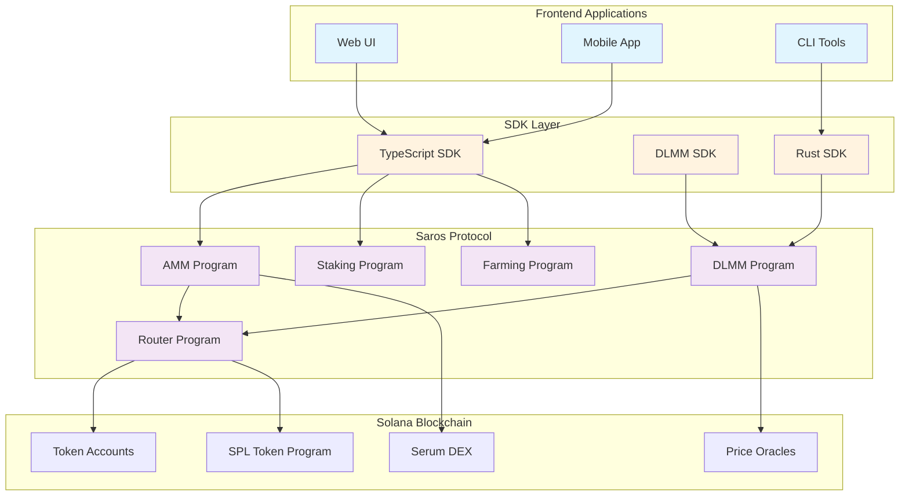

---

## AMM Swap Flow

Traditional AMM swap execution flow.

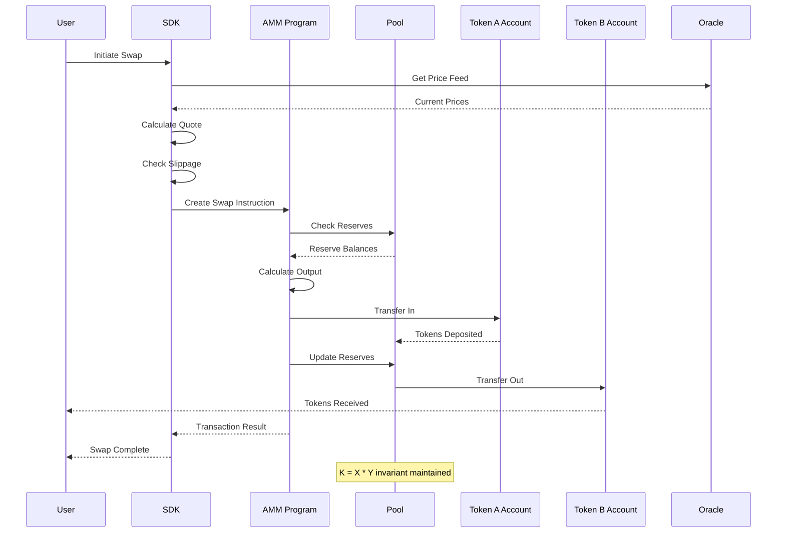

---

## DLMM Architecture

Dynamic Liquidity Market Maker (DLMM) bin-based architecture.

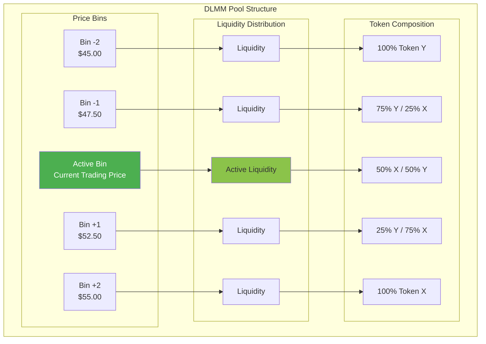

---

## DLMM Liquidity Provision

Flow for providing concentrated liquidity in DLMM.

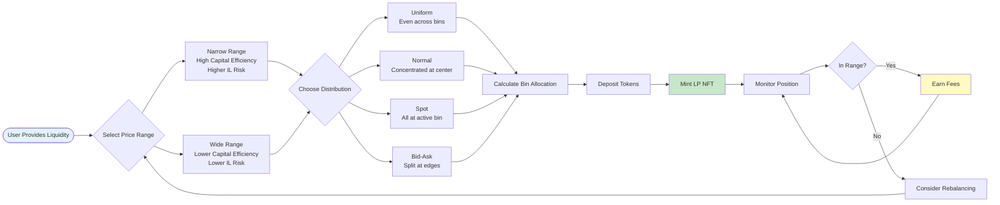

---

## Auto-Compound Flow

Automated yield farming and reinvestment flow.

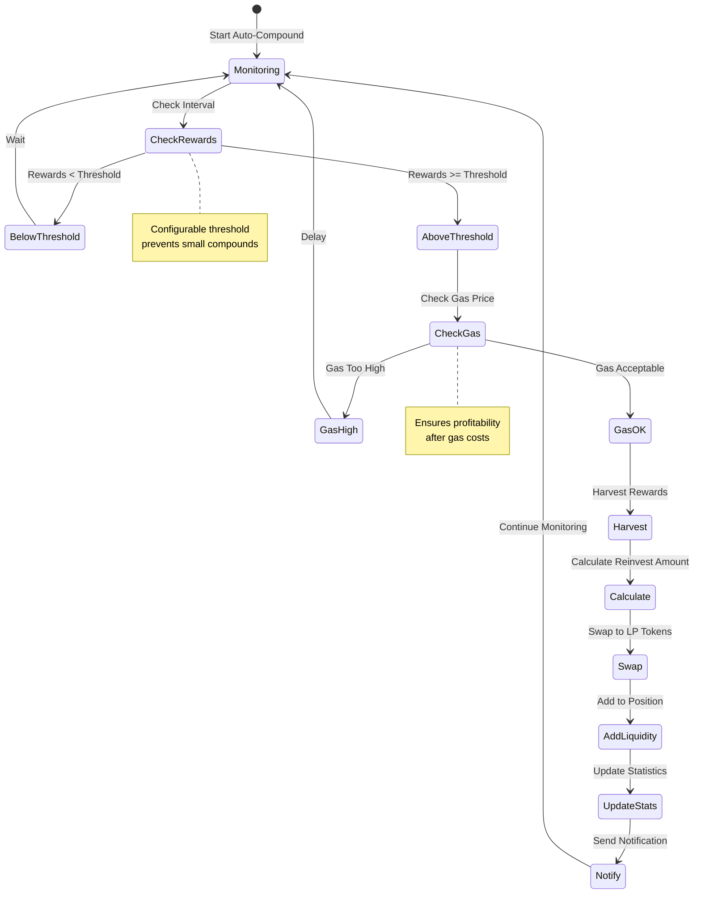

---

## Multi-Hop Routing

Optimal path finding for token swaps.

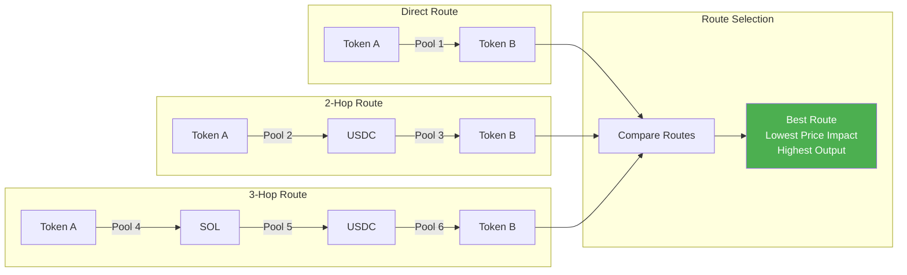

---

## Yield Farming Architecture

Complete yield farming ecosystem flow.

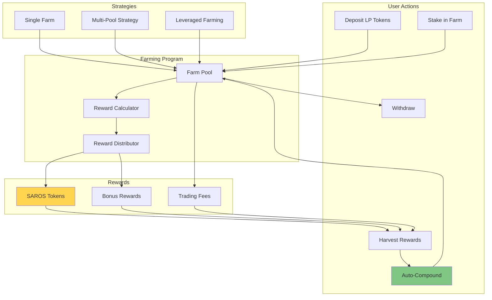

---

## SDK Integration Flow

How developers integrate with Saros SDKs.

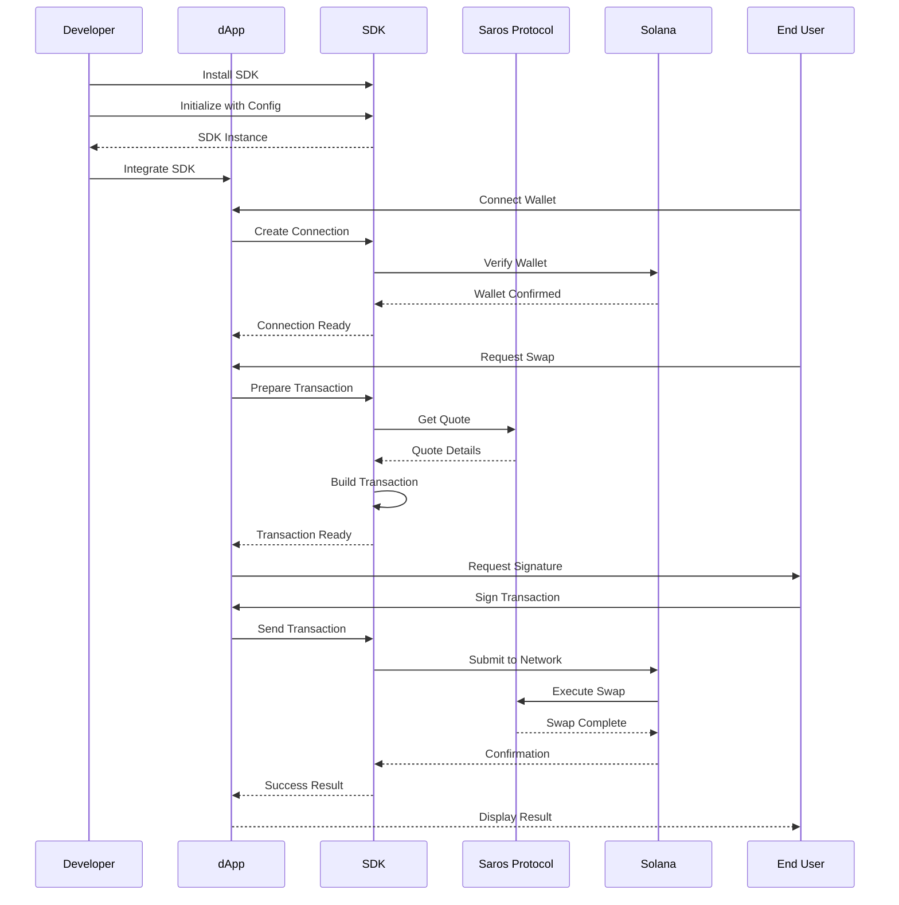

---

## DLMM Position Lifecycle

Complete lifecycle of a DLMM liquidity position.

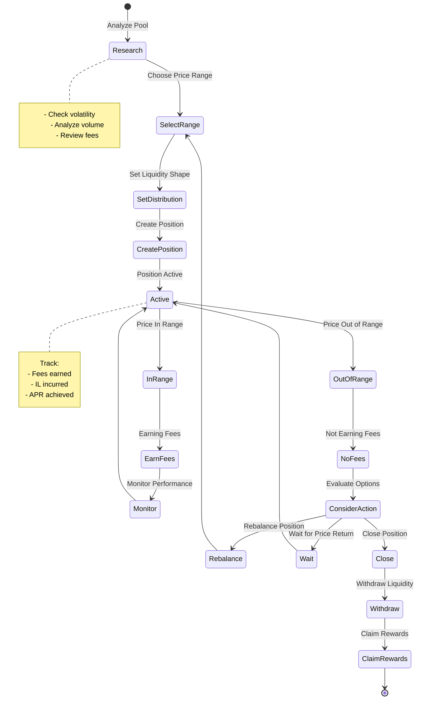

---

## Transaction Flow with Error Handling

Complete transaction flow including error scenarios.

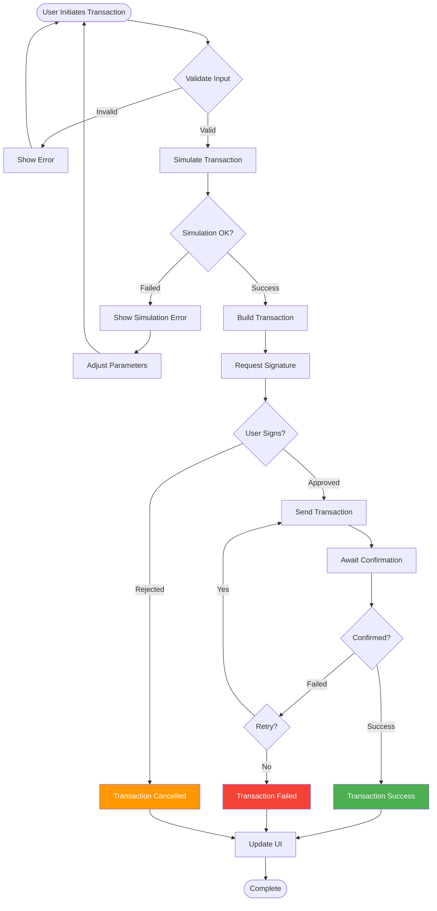

---

## Oracle Integration

Price oracle integration for accurate pricing.

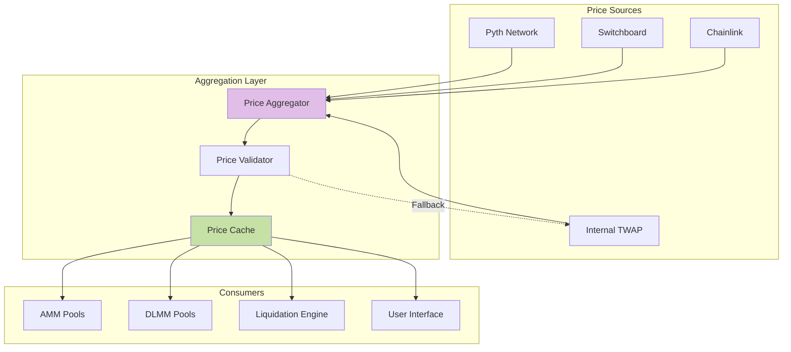

---

## Liquidity Migration Flow

Migrating liquidity between different pool types.

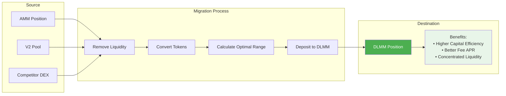

---

## Notes

- All diagrams are rendered using Mermaid.js
- Colors indicate different system layers
- Arrows show data/control flow
- Dotted lines indicate optional or fallback paths

These diagrams provide a visual understanding of:
1. Overall system architecture
2. Transaction flows
3. DLMM's unique bin-based system
4. Complex operations like auto-compounding
5. Integration patterns for developers

For interactive versions, paste these diagrams into any Mermaid-compatible viewer or documentation system.