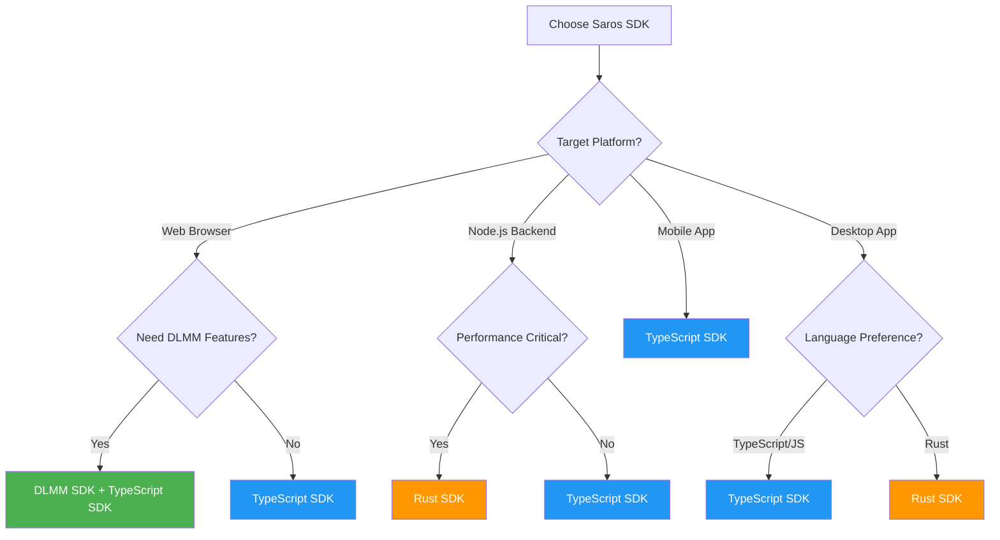
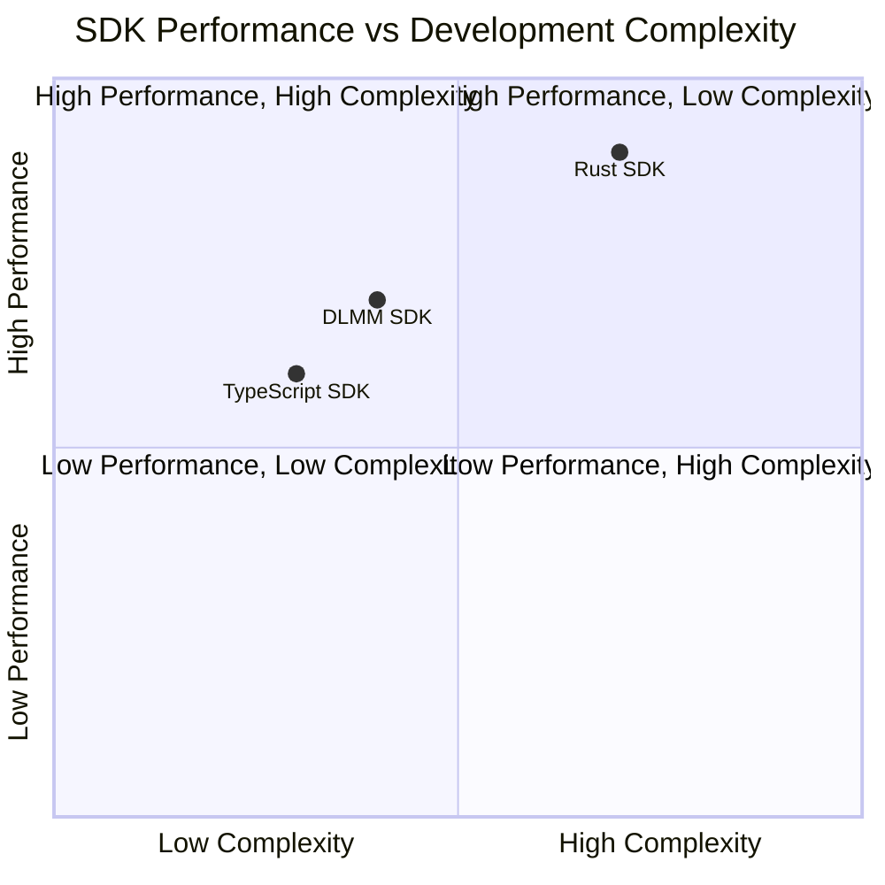

# SDK Comparison Guide

A comprehensive comparison of Saros Finance SDKs to help developers choose the right tool for their project.

## SDK Selection Decision Tree



## Performance vs Complexity Matrix



## Quick Decision Matrix

| Use Case | Recommended SDK | Why |
|----------|----------------|-----|
| Web3 dApp Frontend | TypeScript SDK | Browser-compatible, React integration |
| DLMM Concentrated Liquidity | DLMM SDK | Specialized for bin-based liquidity |
| High-Performance Trading Bot | Rust SDK | Maximum performance, low latency |
| Backend Services | TypeScript SDK or Rust SDK | Depends on stack |
| Analytics & Data Processing | Rust SDK | Better performance for large datasets |
| Quick Prototyping | TypeScript SDK | Faster development cycle |
| Mobile App (React Native) | TypeScript SDK | JavaScript compatibility |

---

## SDK Feature Comparison

### Core Features

| Feature | TypeScript SDK | DLMM SDK | Rust SDK |
|---------|---------------|----------|----------|
| **Version** | 2.4.0 | 1.3.2 | 0.1.5 |
| **Language** | TypeScript/JavaScript | TypeScript | Rust |
| **Package Manager** | npm/yarn | npm/yarn | cargo |
| **Bundle Size** | ~250KB | ~180KB | ~150KB (WASM) |
| **Type Safety** | ✅ Full | ✅ Full | ✅ Full |
| **Browser Support** | ✅ Yes | ✅ Yes | ⚠️ Via WASM |
| **Node.js Support** | ✅ Yes | ✅ Yes | ✅ Yes |
| **Documentation** | Excellent | Excellent | Good |
| **Community Support** | Large | Growing | Emerging |

### Protocol Support

| Protocol Feature | TypeScript SDK | DLMM SDK | Rust SDK |
|-----------------|---------------|----------|----------|
| **AMM Swaps** | ✅ Full | ❌ No | ✅ Full |
| **DLMM Operations** | ⚠️ Basic | ✅ Full | ✅ Full |
| **Liquidity Provision** | ✅ Yes | ✅ Yes | ✅ Yes |
| **Staking** | ✅ Yes | ❌ No | ✅ Yes |
| **Yield Farming** | ✅ Yes | ❌ No | ✅ Yes |
| **Multi-hop Routing** | ✅ Yes | ⚠️ Limited | ✅ Yes |
| **Range Orders** | ❌ No | ✅ Yes | ✅ Yes |
| **Oracle Integration** | ✅ Yes | ✅ Yes | ✅ Yes |

### Performance Metrics

| Metric | TypeScript SDK | DLMM SDK | Rust SDK |
|--------|---------------|----------|----------|
| **Transaction Building** | ~50ms | ~30ms | ~5ms |
| **Quote Calculation** | ~20ms | ~15ms | ~2ms |
| **Batch Operations** | 10 tx/sec | 15 tx/sec | 100 tx/sec |
| **Memory Usage** | Medium | Low | Very Low |
| **Startup Time** | ~500ms | ~300ms | ~50ms |

---

## TypeScript SDK

### Overview
The main SDK for most developers, offering comprehensive access to all Saros Finance features.

### Strengths
- 🎯 **Complete Feature Set**: Access to all Saros protocols
- 🔧 **Easy Integration**: Works seamlessly with popular frameworks
- 📚 **Extensive Documentation**: Best documented SDK
- 🌐 **Browser Ready**: Perfect for web applications
- 🔄 **Active Development**: Most frequently updated

### Weaknesses
- 🐢 Performance overhead compared to Rust
- 📦 Larger bundle size
- 🔋 Higher memory usage

### Best For
- Web3 dApp frontends
- React/Vue/Angular applications
- Node.js backend services
- Rapid prototyping
- Educational projects

### Code Example
```typescript
import { SarosSDK } from '@saros-finance/sdk';

const sdk = new SarosSDK({
  rpcUrl: 'https://api.mainnet-beta.solana.com',
  wallet: wallet
});

// Simple swap
const result = await sdk.swap({
  fromToken: 'SOL',
  toToken: 'USDC',
  amount: 1.5,
  slippage: 0.5
});
```

### Installation
```bash
npm install @saros-finance/sdk
# or
yarn add @saros-finance/sdk
```

---

## DLMM SDK

### Overview
Specialized SDK for Dynamic Liquidity Market Maker operations with concentrated liquidity.

### Strengths
- 🎯 **DLMM Specialized**: Purpose-built for concentrated liquidity
- 📊 **Bin Management**: Advanced bin-level control
- 💰 **Capital Efficiency**: Optimize liquidity positions
- 📈 **Range Orders**: Built-in limit order functionality
- 🔬 **Precise Control**: Fine-grained position management

### Weaknesses
- 🚫 No AMM support
- 🚫 No staking/farming features
- 📚 Requires DLMM knowledge
- 👥 Smaller community

### Best For
- DLMM liquidity providers
- Advanced trading strategies
- Range order implementations
- Capital-efficient market making
- Professional liquidity management

### Code Example
```typescript
import { DLMMClient } from '@saros-finance/dlmm-sdk';

const client = new DLMMClient({
  rpcUrl: RPC_URL,
  wallet: wallet
});

// Create concentrated position
const position = await client.createPosition({
  poolAddress: POOL_ADDRESS,
  lowerBinId: -50,
  upperBinId: 50,
  totalLiquidity: new BN(10000),
  distributionMode: { type: 'NORMAL', sigma: 1.5 }
});
```

### Installation
```bash
npm install @saros-finance/dlmm-sdk
# or
yarn add @saros-finance/dlmm-sdk
```

---

## Rust SDK

### Overview
High-performance SDK for advanced use cases requiring maximum efficiency.

### Strengths
- ⚡ **Maximum Performance**: Fastest execution
- 🔒 **Memory Safe**: Rust's safety guarantees
- 🎮 **Low Latency**: Ideal for trading bots
- 💾 **Minimal Resources**: Lowest memory footprint
- 🔧 **Systems Programming**: Direct hardware access

### Weaknesses
- 📚 Steeper learning curve
- 🌐 Complex browser integration
- 👥 Smallest community
- 📖 Less documentation

### Best For
- High-frequency trading bots
- MEV strategies
- Large-scale data processing
- Performance-critical applications
- Systems integration

### Code Example
```rust
use saros_dlmm_sdk::{Client, SwapParams};
use solana_sdk::pubkey::Pubkey;

#[tokio::main]
async fn main() -> Result<(), Box<dyn std::error::Error>> {
    let client = Client::new("https://api.mainnet-beta.solana.com");
    
    let params = SwapParams {
        from_mint: from_mint_pubkey,
        to_mint: to_mint_pubkey,
        amount: 1000000000, // 1 SOL in lamports
        slippage: 50, // 0.5%
    };
    
    let result = client.swap(params).await?;
    println!("Swap signature: {}", result.signature);
    Ok(())
}
```

### Installation
```toml
[dependencies]
saros-dlmm-sdk = "0.1.5"
solana-sdk = "1.17"
tokio = { version = "1", features = ["full"] }
```

---

## Decision Framework

### Choose TypeScript SDK if:
- ✅ Building a web application
- ✅ Need access to all Saros features
- ✅ Want fastest development speed
- ✅ Team is familiar with JavaScript
- ✅ Need extensive documentation

### Choose DLMM SDK if:
- ✅ Focus on concentrated liquidity
- ✅ Need advanced DLMM features
- ✅ Building professional LP tools
- ✅ Want range order functionality
- ✅ Optimizing capital efficiency

### Choose Rust SDK if:
- ✅ Building high-frequency trading systems
- ✅ Need maximum performance
- ✅ Processing large datasets
- ✅ Implementing MEV strategies
- ✅ Resource constraints are critical

---

## Migration Paths

### TypeScript SDK → DLMM SDK
For projects needing specialized DLMM features:

```typescript
// Before (TypeScript SDK)
const pool = await sdk.getPool(poolAddress);
const position = await sdk.addLiquidity({
  pool: poolAddress,
  amount: 1000
});

// After (DLMM SDK)
const pool = await dlmmClient.getPool(poolAddress);
const position = await dlmmClient.createPosition({
  poolAddress,
  lowerBinId: -50,
  upperBinId: 50,
  totalLiquidity: new BN(1000),
  distributionMode: { type: 'UNIFORM' }
});
```

### TypeScript SDK → Rust SDK
For performance optimization:

```typescript
// TypeScript
const result = await sdk.swap({
  fromToken: 'SOL',
  toToken: 'USDC',
  amount: 1.0
});
```

```rust
// Rust
let result = client.swap(SwapParams {
    from_mint: sol_mint,
    to_mint: usdc_mint,
    amount: 1_000_000_000,
    slippage: 50,
}).await?;
```

---

## Integration Complexity

### Easiest to Hardest

1. **TypeScript SDK** ⭐
   - npm install and import
   - Familiar async/await patterns
   - Extensive examples

2. **DLMM SDK** ⭐⭐
   - Similar to TypeScript SDK
   - Requires understanding of DLMM concepts
   - Good TypeScript support

3. **Rust SDK** ⭐⭐⭐
   - Requires Rust knowledge
   - More complex build process
   - WASM compilation for browser

---

## Cost Analysis

### Development Cost

| SDK | Initial Setup | Learning Curve | Maintenance |
|-----|--------------|----------------|-------------|
| TypeScript | Low | Low | Low |
| DLMM | Low | Medium | Low |
| Rust | Medium | High | Medium |

### Operational Cost

| SDK | RPC Calls | Compute Units | Transaction Size |
|-----|-----------|---------------|------------------|
| TypeScript | Standard | Standard | Standard |
| DLMM | Optimized | Lower | Smaller |
| Rust | Minimal | Lowest | Smallest |

---

## Ecosystem Compatibility

### Framework Support

| Framework | TypeScript SDK | DLMM SDK | Rust SDK |
|-----------|---------------|----------|----------|
| React | ✅ Native | ✅ Native | ⚠️ WASM |
| Next.js | ✅ Native | ✅ Native | ⚠️ WASM |
| Vue | ✅ Native | ✅ Native | ⚠️ WASM |
| Angular | ✅ Native | ✅ Native | ⚠️ WASM |
| React Native | ✅ Yes | ✅ Yes | ❌ No |
| Node.js | ✅ Native | ✅ Native | ✅ Native |
| Deno | ✅ Yes | ✅ Yes | ⚠️ Limited |

### Wallet Integration

| Wallet | TypeScript SDK | DLMM SDK | Rust SDK |
|--------|---------------|----------|----------|
| Phantom | ✅ Yes | ✅ Yes | ✅ Yes |
| Solflare | ✅ Yes | ✅ Yes | ✅ Yes |
| Backpack | ✅ Yes | ✅ Yes | ✅ Yes |
| Ledger | ✅ Yes | ✅ Yes | ✅ Yes |
| CLI Wallet | ✅ Yes | ✅ Yes | ✅ Yes |

---

## Recommendations by Project Type

### DeFi Dashboard
**Recommended**: TypeScript SDK
- Full protocol access
- Easy integration
- Rich UI components

### Liquidity Management Platform
**Recommended**: DLMM SDK + TypeScript SDK
- DLMM SDK for concentrated liquidity
- TypeScript SDK for other features

### Trading Bot
**Recommended**: Rust SDK
- Maximum performance
- Low latency
- Efficient resource usage

### Mobile Wallet
**Recommended**: TypeScript SDK
- React Native support
- Broad feature set
- Good documentation

### Analytics Platform
**Recommended**: Rust SDK or TypeScript SDK
- Rust for heavy processing
- TypeScript for web interface

---

## Version Compatibility

| Solana Version | TypeScript SDK | DLMM SDK | Rust SDK |
|----------------|---------------|----------|----------|
| 1.16.x | ✅ 2.3.x+ | ✅ 1.2.x+ | ✅ 0.1.x+ |
| 1.17.x | ✅ 2.4.x+ | ✅ 1.3.x+ | ✅ 0.1.5+ |
| 1.18.x | 🔄 Testing | 🔄 Testing | 🔄 Testing |

---

## Support & Resources

### Documentation Quality
- **TypeScript SDK**: ⭐⭐⭐⭐⭐ Comprehensive
- **DLMM SDK**: ⭐⭐⭐⭐ Detailed
- **Rust SDK**: ⭐⭐⭐ Growing

### Community Support
- **TypeScript SDK**: Large, active community
- **DLMM SDK**: Growing specialized community
- **Rust SDK**: Small but technical community

### Update Frequency
- **TypeScript SDK**: Weekly updates
- **DLMM SDK**: Bi-weekly updates
- **Rust SDK**: Monthly updates

---

## Conclusion

Each SDK serves specific use cases:

- **TypeScript SDK**: The go-to choice for most developers
- **DLMM SDK**: Essential for concentrated liquidity features
- **Rust SDK**: Critical for performance-sensitive applications

Choose based on your:
1. Technical requirements
2. Team expertise
3. Performance needs
4. Feature requirements
5. Development timeline

For most projects, starting with the TypeScript SDK and adding specialized SDKs as needed is the recommended approach.