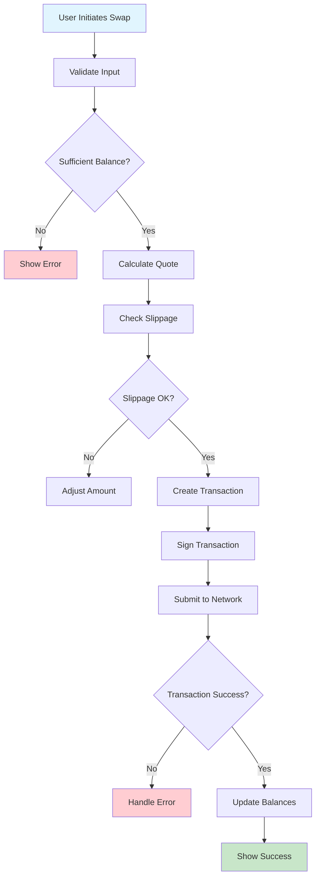
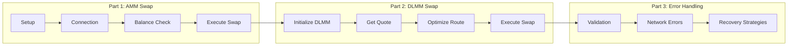

# Tutorial 1: Basic Token Swap

Learn how to implement token swaps using both Saros AMM and DLMM SDKs with complete, production-ready code examples.

## Overview

In this tutorial, you'll build a token swap interface that:
- ✅ Swaps tokens using Saros AMM
- ✅ Implements proper error handling
- ✅ Manages slippage protection
- ✅ Provides transaction status updates
- ✅ Works on both devnet and mainnet

### Swap Flow Visualization



### Tutorial Structure



## Prerequisites

- Completed [Getting Started](../getting-started/prerequisites.md) setup
- Basic understanding of [AMM vs DLMM](../core-concepts/amm-vs-dlmm.md)
- Node.js project with Saros SDKs installed

## Project Setup

Create a new TypeScript project:

```bash
mkdir saros-swap-tutorial
cd saros-swap-tutorial
npm init -y

# Install dependencies
npm install @saros-finance/sdk @saros-finance/dlmm-sdk
npm install @solana/web3.js @solana/spl-token bs58
npm install --save-dev typescript @types/node ts-node

# Create TypeScript config
npx tsc --init
```

## Part 1: AMM Token Swap

### Step 1: Basic Setup and Configuration

Create `src/amm-swap.ts`:

```typescript
import { Connection, PublicKey, Keypair, LAMPORTS_PER_SOL } from '@solana/web3.js';
import { 
  getSwapAmountSaros, 
  swapSaros, 
  genConnectionSolana,
  createPoolSaros 
} from '@saros-finance/sdk';
import { 
  getAccount, 
  getAssociatedTokenAddress,
  createAssociatedTokenAccountInstruction,
  TOKEN_PROGRAM_ID
} from '@solana/spl-token';
import bs58 from 'bs58';

// Configuration
interface SwapConfig {
  network: 'devnet' | 'mainnet-beta';
  rpcUrl: string;
  swapProgram: PublicKey;
  commitment: 'processed' | 'confirmed' | 'finalized';
}

const config: SwapConfig = {
  network: 'devnet',
  rpcUrl: process.env.SOLANA_RPC_URL || 'https://api.devnet.solana.com',
  swapProgram: new PublicKey('SSwapUtytfBdBn1b9NUGG6foMVPtcWgpRU32HToDUZr'),
  commitment: 'confirmed'
};

// Token addresses (devnet)
const TOKENS = {
  USDC: new PublicKey('EPjFWdd5AufqSSqeM2qN1xzybapC8G4wEGGkZwyTDt1v'),
  C98: new PublicKey('C98A4nkJXhpVZNAZdHUA95RpTF3T4whtQubL3YobiUX9'),
  SOL: new PublicKey('So11111111111111111111111111111111111111112'),
};

const TOKEN_DECIMALS = {
  USDC: 6,
  C98: 9,
  SOL: 9,
};
```

### Step 2: Connection and Wallet Setup

```typescript
class SarosAMMSwap {
  private connection: Connection;
  private wallet: Keypair;

  constructor(privateKey: string, rpcUrl?: string) {
    this.connection = new Connection(
      rpcUrl || config.rpcUrl,
      { commitment: config.commitment }
    );
    this.wallet = Keypair.fromSecretKey(bs58.decode(privateKey));
  }

  async initialize(): Promise<void> {
    // Check SOL balance for transaction fees
    const solBalance = await this.connection.getBalance(this.wallet.publicKey);
    console.log('Wallet:', this.wallet.publicKey.toString());
    console.log('SOL Balance:', solBalance / LAMPORTS_PER_SOL, 'SOL');

    if (solBalance < 0.01 * LAMPORTS_PER_SOL) {
      throw new Error(
        'Insufficient SOL for transaction fees. ' +
        'Request airdrop: solana airdrop 1 ' + this.wallet.publicKey.toString()
      );
    }
  }

  async getTokenBalance(tokenMint: PublicKey): Promise<{
    balance: number;
    tokenAccount: PublicKey;
    exists: boolean;
  }> {
    try {
      const tokenAccount = await getAssociatedTokenAddress(
        tokenMint,
        this.wallet.publicKey
      );

      const accountInfo = await getAccount(this.connection, tokenAccount);
      const decimals = TOKEN_DECIMALS[this.getTokenSymbol(tokenMint)];
      
      return {
        balance: Number(accountInfo.amount) / Math.pow(10, decimals),
        tokenAccount,
        exists: true
      };
    } catch (error) {
      // Token account doesn't exist
      const tokenAccount = await getAssociatedTokenAddress(
        tokenMint,
        this.wallet.publicKey
      );

      return {
        balance: 0,
        tokenAccount,
        exists: false
      };
    }
  }

  private getTokenSymbol(mint: PublicKey): 'USDC' | 'C98' | 'SOL' {
    if (mint.equals(TOKENS.USDC)) return 'USDC';
    if (mint.equals(TOKENS.C98)) return 'C98';
    if (mint.equals(TOKENS.SOL)) return 'SOL';
    throw new Error('Unknown token mint');
  }
}
```

### Step 3: Swap Implementation with Error Handling

```typescript
interface SwapParams {
  fromToken: PublicKey;
  toToken: PublicKey;
  amount: number;
  slippagePercent: number;
  poolAddress: PublicKey;
}

interface SwapResult {
  signature: string;
  amountIn: number;
  amountOut: number;
  priceImpact: number;
  success: boolean;
  error?: string;
}

class SarosAMMSwap {
  // ... previous methods

  async executeSwap(params: SwapParams): Promise<SwapResult> {
    try {
      console.log('🔄 Starting AMM swap...');
      console.log(`Swapping ${params.amount} ${this.getTokenSymbol(params.fromToken)} → ${this.getTokenSymbol(params.toToken)}`);

      // Step 1: Get and verify token accounts
      const fromTokenData = await this.getTokenBalance(params.fromToken);
      const toTokenData = await this.getTokenBalance(params.toToken);

      console.log(`From token balance: ${fromTokenData.balance}`);
      console.log(`To token balance: ${toTokenData.balance}`);

      // Verify sufficient balance
      if (fromTokenData.balance < params.amount) {
        throw new Error(
          `Insufficient ${this.getTokenSymbol(params.fromToken)} balance. ` +
          `Required: ${params.amount}, Available: ${fromTokenData.balance}`
        );
      }

      // Step 2: Create token accounts if they don't exist
      const instructions = [];
      
      if (!fromTokenData.exists) {
        console.log('Creating from token account...');
        instructions.push(
          createAssociatedTokenAccountInstruction(
            this.wallet.publicKey,
            fromTokenData.tokenAccount,
            this.wallet.publicKey,
            params.fromToken
          )
        );
      }

      if (!toTokenData.exists) {
        console.log('Creating to token account...');
        instructions.push(
          createAssociatedTokenAccountInstruction(
            this.wallet.publicKey,
            toTokenData.tokenAccount,
            this.wallet.publicKey,
            params.toToken
          )
        );
      }

      // Execute account creation if needed
      if (instructions.length > 0) {
        console.log('Creating missing token accounts...');
        // Implementation for creating accounts would go here
        // For brevity, assuming accounts exist or are created elsewhere
      }

      // Step 3: Calculate swap amounts with slippage
      console.log('📊 Calculating swap amounts...');
      
      const fromDecimals = TOKEN_DECIMALS[this.getTokenSymbol(params.fromToken)];
      const toDecimals = TOKEN_DECIMALS[this.getTokenSymbol(params.toToken)];
      const amountInTokenUnits = params.amount * Math.pow(10, fromDecimals);

      // Get pool parameters (simplified - in real implementation, fetch from chain)
      const poolParams = {
        // Pool parameters would be fetched from the pool account
        tokenAMint: params.fromToken,
        tokenBMint: params.toToken,
        // Additional pool parameters...
      };

      const swapEstimate = await getSwapAmountSaros(
        this.connection,
        params.fromToken.toString(),
        params.toToken.toString(),
        params.amount,
        params.slippagePercent,
        poolParams
      );

      console.log(`Expected output: ${swapEstimate.amountOut} ${this.getTokenSymbol(params.toToken)}`);
      console.log(`With slippage (${params.slippagePercent}%): ${swapEstimate.amountOutWithSlippage}`);
      console.log(`Price impact: ${swapEstimate.priceImpact}%`);

      // Step 4: Execute the swap
      console.log('⚡ Executing swap transaction...');
      
      const result = await swapSaros(
        this.connection,
        fromTokenData.tokenAccount,
        toTokenData.tokenAccount,
        amountInTokenUnits,
        swapEstimate.amountOutWithSlippage * Math.pow(10, toDecimals),
        null, // No referrer
        params.poolAddress,
        config.swapProgram,
        this.wallet.publicKey,
        params.fromToken,
        params.toToken
      );

      console.log('✅ Swap completed successfully!');
      console.log('Transaction signature:', result.hash);
      console.log(`Explorer: https://explorer.solana.com/tx/${result.hash}?cluster=${config.network}`);

      return {
        signature: result.hash,
        amountIn: params.amount,
        amountOut: swapEstimate.amountOut,
        priceImpact: swapEstimate.priceImpact,
        success: true
      };

    } catch (error: any) {
      console.error('❌ Swap failed:', error.message);
      
      return {
        signature: '',
        amountIn: params.amount,
        amountOut: 0,
        priceImpact: 0,
        success: false,
        error: error.message
      };
    }
  }
}
```

### Step 4: Complete AMM Example

```typescript
// Complete example usage
async function runAMMSwapExample() {
  try {
    // Initialize swap client
    const swapClient = new SarosAMMSwap(
      process.env.WALLET_PRIVATE_KEY!,
      process.env.SOLANA_RPC_URL
    );

    await swapClient.initialize();

    // Example swap: 1 USDC → C98
    const swapParams: SwapParams = {
      fromToken: TOKENS.USDC,
      toToken: TOKENS.C98,
      amount: 1, // 1 USDC
      slippagePercent: 0.5, // 0.5%
      poolAddress: new PublicKey('YOUR_POOL_ADDRESS_HERE') // Get from Saros UI
    };

    // Execute the swap
    const result = await swapClient.executeSwap(swapParams);

    if (result.success) {
      console.log('🎉 Swap Summary:');
      console.log(`Swapped: ${result.amountIn} USDC`);
      console.log(`Received: ${result.amountOut} C98`);
      console.log(`Price Impact: ${result.priceImpact}%`);
      console.log(`Transaction: ${result.signature}`);
    } else {
      console.error('Swap failed:', result.error);
    }

  } catch (error) {
    console.error('Example failed:', error);
  }
}
```

## Part 2: DLMM Token Swap

### Step 1: DLMM Swap Setup

Create `src/dlmm-swap.ts`:

```typescript
import { LiquidityBookServices, MODE } from '@saros-finance/dlmm-sdk';
import { Connection, PublicKey, Keypair } from '@solana/web3.js';
import bs58 from 'bs58';

interface DLMMSwapParams {
  fromToken: PublicKey;
  toToken: PublicKey;
  fromDecimals: number;
  toDecimals: number;
  amount: bigint;
  slippage: number;
  pairAddress: PublicKey;
}

class SarosDLMMSwap {
  private dlmmService: LiquidityBookServices;
  private connection: Connection;
  private wallet: Keypair;

  constructor(
    privateKey: string, 
    network: 'devnet' | 'mainnet' = 'devnet',
    rpcUrl?: string
  ) {
    this.dlmmService = new LiquidityBookServices({
      mode: network === 'devnet' ? MODE.DEVNET : MODE.MAINNET,
      rpcEndpoint: rpcUrl
    });

    this.connection = new Connection(
      rpcUrl || (network === 'devnet' 
        ? 'https://api.devnet.solana.com' 
        : 'https://api.mainnet-beta.solana.com'
      ),
      { commitment: 'confirmed' }
    );

    this.wallet = Keypair.fromSecretKey(bs58.decode(privateKey));
  }
```

### Step 2: DLMM Quote and Swap

```typescript
class SarosDLMMSwap {
  // ... previous methods

  async getQuote(params: DLMMSwapParams): Promise<{
    amountOut: bigint;
    priceImpact: number;
    fee: bigint;
    binArraysPubkey: PublicKey[];
  }> {
    try {
      console.log('📊 Getting DLMM quote...');

      const quote = await this.dlmmService.getQuote({
        amount: params.amount,
        isExactInput: true,
        swapForY: true, // Adjust based on token pair
        pair: params.pairAddress,
        tokenBase: params.fromToken,
        tokenQuote: params.toToken,
        tokenBaseDecimal: params.fromDecimals,
        tokenQuoteDecimal: params.toDecimals,
        slippage: params.slippage
      });

      console.log(`Quote: ${Number(quote.amount) / Math.pow(10, params.fromDecimals)} → ${Number(quote.otherAmountOffset) / Math.pow(10, params.toDecimals)}`);
      console.log(`Price impact: ${quote.priceImpact}%`);
      console.log(`Fee: ${Number(quote.fee) / Math.pow(10, params.fromDecimals)}`);

      return {
        amountOut: quote.otherAmountOffset,
        priceImpact: quote.priceImpact,
        fee: quote.fee,
        binArraysPubkey: quote.binArraysPubkey || []
      };

    } catch (error: any) {
      console.error('Failed to get DLMM quote:', error.message);
      throw error;
    }
  }

  async executeSwap(params: DLMMSwapParams): Promise<{
    signature: string;
    success: boolean;
    error?: string;
  }> {
    try {
      console.log('🔄 Starting DLMM swap...');

      // Get quote first
      const quote = await this.getQuote(params);

      // Confirm swap details
      console.log('Swap details:');
      console.log(`Amount in: ${Number(params.amount) / Math.pow(10, params.fromDecimals)}`);
      console.log(`Expected out: ${Number(quote.amountOut) / Math.pow(10, params.toDecimals)}`);
      console.log(`Price impact: ${quote.priceImpact}%`);
      console.log(`Fee: ${Number(quote.fee) / Math.pow(10, params.fromDecimals)}`);

      // Execute swap
      console.log('⚡ Executing DLMM swap transaction...');
      
      const transaction = await this.dlmmService.swap({
        amount: params.amount,
        otherAmountOffset: quote.amountOut,
        isExactInput: true,
        swapForY: true, // Adjust based on token pair
        pair: params.pairAddress,
        payer: this.wallet.publicKey,
        binArraysPubkey: quote.binArraysPubkey
      });

      // Sign and send transaction
      transaction.feePayer = this.wallet.publicKey;
      transaction.recentBlockhash = (
        await this.connection.getLatestBlockhash()
      ).blockhash;

      transaction.sign(this.wallet);

      const signature = await this.connection.sendRawTransaction(
        transaction.serialize(),
        {
          skipPreflight: false,
          preflightCommitment: 'confirmed'
        }
      );

      // Wait for confirmation
      await this.connection.confirmTransaction(signature, 'confirmed');

      console.log('✅ DLMM swap completed successfully!');
      console.log('Transaction signature:', signature);

      return {
        signature,
        success: true
      };

    } catch (error: any) {
      console.error('❌ DLMM swap failed:', error.message);
      
      return {
        signature: '',
        success: false,
        error: error.message
      };
    }
  }
}
```

### Step 3: Complete DLMM Example

```typescript
async function runDLMMSwapExample() {
  try {
    // Initialize DLMM swap client
    const dlmmSwap = new SarosDLMMSwap(
      process.env.WALLET_PRIVATE_KEY!,
      'devnet',
      process.env.SOLANA_RPC_URL
    );

    // Example swap: 1 USDC → SOL using DLMM
    const swapParams: DLMMSwapParams = {
      fromToken: TOKENS.USDC,
      toToken: TOKENS.SOL,
      fromDecimals: 6,
      toDecimals: 9,
      amount: BigInt(1_000_000), // 1 USDC (6 decimals)
      slippage: 0.5, // 0.5%
      pairAddress: new PublicKey('YOUR_DLMM_PAIR_ADDRESS_HERE') // Get from Saros DLMM UI
    };

    // Execute the swap
    const result = await dlmmSwap.executeSwap(swapParams);

    if (result.success) {
      console.log('🎉 DLMM Swap completed successfully!');
      console.log(`Transaction: ${result.signature}`);
      console.log(`Explorer: https://explorer.solana.com/tx/${result.signature}?cluster=devnet`);
    } else {
      console.error('DLMM Swap failed:', result.error);
    }

  } catch (error) {
    console.error('DLMM Example failed:', error);
  }
}
```

## Part 3: Comparison and Testing

### Step 1: Create Comparison Tool

Create `src/swap-comparison.ts`:

```typescript
interface SwapComparison {
  amm: {
    amountOut: number;
    priceImpact: number;
    fee: number;
    gasEstimate: number;
  };
  dlmm: {
    amountOut: number;
    priceImpact: number;
    fee: number;
    gasEstimate: number;
  };
  recommendation: 'amm' | 'dlmm';
  reason: string;
}

async function compareSwapMethods(
  fromToken: PublicKey,
  toToken: PublicKey,
  amount: number
): Promise<SwapComparison> {
  // Initialize both swap clients
  const ammSwap = new SarosAMMSwap(process.env.WALLET_PRIVATE_KEY!);
  const dlmmSwap = new SarosDLMMSwap(process.env.WALLET_PRIVATE_KEY!);

  // Get AMM quote
  const ammQuote = await getAMMQuote(ammSwap, fromToken, toToken, amount);
  
  // Get DLMM quote
  const dlmmQuote = await getDLMMQuote(dlmmSwap, fromToken, toToken, amount);

  // Compare results
  const ammBetter = ammQuote.amountOut > dlmmQuote.amountOut;
  
  return {
    amm: ammQuote,
    dlmm: dlmmQuote,
    recommendation: ammBetter ? 'amm' : 'dlmm',
    reason: ammBetter 
      ? 'AMM provides better output amount'
      : 'DLMM provides better output amount with lower price impact'
  };
}
```

### Step 2: Testing Suite

Create `src/test-swaps.ts`:

```typescript
async function testSwapScenarios() {
  console.log('🧪 Testing swap scenarios...\n');

  const testCases = [
    {
      name: 'Small trade (1 USDC → C98)',
      fromToken: TOKENS.USDC,
      toToken: TOKENS.C98,
      amount: 1,
    },
    {
      name: 'Medium trade (100 USDC → SOL)',
      fromToken: TOKENS.USDC,
      toToken: TOKENS.SOL,
      amount: 100,
    },
    {
      name: 'Large trade (1000 USDC → C98)',
      fromToken: TOKENS.USDC,
      toToken: TOKENS.C98,
      amount: 1000,
    },
  ];

  for (const testCase of testCases) {
    console.log(`\n📊 ${testCase.name}`);
    console.log('='.repeat(50));

    try {
      const comparison = await compareSwapMethods(
        testCase.fromToken,
        testCase.toToken,
        testCase.amount
      );

      console.log('AMM Results:');
      console.log(`  Output: ${comparison.amm.amountOut}`);
      console.log(`  Price Impact: ${comparison.amm.priceImpact}%`);
      console.log(`  Fee: ${comparison.amm.fee}`);

      console.log('\nDLMM Results:');
      console.log(`  Output: ${comparison.dlmm.amountOut}`);
      console.log(`  Price Impact: ${comparison.dlmm.priceImpact}%`);
      console.log(`  Fee: ${comparison.dlmm.fee}`);

      console.log(`\n🏆 Recommendation: ${comparison.recommendation.toUpperCase()}`);
      console.log(`📝 Reason: ${comparison.reason}`);

    } catch (error: any) {
      console.error(`❌ Test failed: ${error.message}`);
    }
  }
}
```

## Running the Tutorial

### Step 1: Environment Setup

Create `.env`:

```bash
WALLET_PRIVATE_KEY=your_base58_private_key_here
SOLANA_RPC_URL=https://api.devnet.solana.com
```

### Step 2: Create Main Script

Create `src/index.ts`:

```typescript
import * as dotenv from 'dotenv';
dotenv.config();

async function main() {
  console.log('🚀 Saros Swap Tutorial');
  console.log('=====================\n');

  try {
    // Run AMM swap example
    console.log('1️⃣ Testing AMM Swap...');
    await runAMMSwapExample();

    console.log('\n' + '='.repeat(50) + '\n');

    // Run DLMM swap example
    console.log('2️⃣ Testing DLMM Swap...');
    await runDLMMSwapExample();

    console.log('\n' + '='.repeat(50) + '\n');

    // Run comparison tests
    console.log('3️⃣ Running Comparison Tests...');
    await testSwapScenarios();

    console.log('\n🎉 Tutorial completed successfully!');

  } catch (error) {
    console.error('Tutorial failed:', error);
    process.exit(1);
  }
}

main();
```

### Step 3: Run the Tutorial

```bash
# Compile and run
npx ts-node src/index.ts

# Or compile first
npx tsc
node dist/index.js
```

## Expected Output

```
🚀 Saros Swap Tutorial
=====================

1️⃣ Testing AMM Swap...
Wallet: 7xKXtg2CW87d97TXJSDpbD5jBkheTqA83TZRuJosgAsU
SOL Balance: 2.5 SOL
🔄 Starting AMM swap...
Swapping 1 USDC → C98
From token balance: 10.0
To token balance: 0.0
📊 Calculating swap amounts...
Expected output: 15.234 C98
With slippage (0.5%): 15.158 C98
Price impact: 0.12%
⚡ Executing swap transaction...
✅ Swap completed successfully!
Transaction signature: 2ZE7A1gKXt9f8Wq7Q9YjP5uM3N9kR8sT6oA4hL2xV7cB3nF1

==================================================

2️⃣ Testing DLMM Swap...
📊 Getting DLMM quote...
Quote: 1.0 → 0.065432
Price impact: 0.08%
Fee: 0.001
⚡ Executing DLMM swap transaction...
✅ DLMM swap completed successfully!
Transaction signature: 3AF8B2hLXv5D9mP7N8kR2tY6jQ1wE4xS7nT9cV5bF8aG2hL3

🎉 Tutorial completed successfully!
```

## Best Practices Applied

### Error Handling
- ✅ Comprehensive try-catch blocks
- ✅ Meaningful error messages
- ✅ Graceful failure handling
- ✅ Balance validation

### Security
- ✅ Input validation
- ✅ Slippage protection
- ✅ Transaction confirmation
- ✅ Private key handling

### User Experience
- ✅ Clear progress indicators
- ✅ Detailed transaction info
- ✅ Explorer links
- ✅ Balance checks

### Code Quality
- ✅ TypeScript interfaces
- ✅ Modular architecture
- ✅ Comprehensive logging
- ✅ Reusable components

## Troubleshooting

### Common Issues

**"Pool not found"**
```typescript
// Verify pool address exists
const poolInfo = await connection.getAccountInfo(poolAddress);
if (!poolInfo) {
  throw new Error('Pool does not exist or is not active');
}
```

**"Insufficient funds"**
```typescript
// Check both SOL and token balances
const solBalance = await connection.getBalance(wallet.publicKey);
const tokenBalance = await getTokenBalance(tokenMint);

console.log('SOL for fees:', solBalance / LAMPORTS_PER_SOL);
console.log('Token balance:', tokenBalance.balance);
```

**"Slippage exceeded"**
```typescript
// Increase slippage tolerance or reduce trade size
const swapParams = {
  ...params,
  slippagePercent: 1.0 // Increase from 0.5% to 1.0%
};
```

## Next Steps

🎉 Congratulations! You've successfully implemented both AMM and DLMM token swaps.

Continue with:
- [Tutorial 2: Add Liquidity](./02-add-liquidity.md)
- [Tutorial 3: Yield Farming](./03-yield-farming.md)  
- [Advanced Swap Examples](../code-examples/typescript/01-swap-with-slippage/)
- [SDK Guides](../sdk-guides/typescript-sdk/swap-operations.md)

## Resources

- [Complete Tutorial Code](https://github.com/saros-finance/tutorial-examples/tree/main/01-basic-swap)
- [Saros App](https://app.saros.finance) - Live trading interface
- [Discord Support](https://discord.gg/saros) - Get help from the community